# Microcontroller Animations
This was my A-Level coursework project. It achieved an overall score of 73/75.
The scores for each section are as follows:
**Analysis:** 8/9
**Design:** 12/12
**Technical Solution - Completeness of Solution:** 15/15
**Technical Solution - Techniques Used:** 27/27
**Testing:** 7/8
**Evaluation:** 4/4

## Table of Contents

- [Analysis](#analysis)
    - [Background](#background)
    - [Definitions](#definitions)
    - [The Current System](#the-current-system)
        - [Questionnaire Responses](#questionnaire-responses)
        - [Conclusions](#conclusions)
    - [Prospective Users](#prospective-users)
        - [User Requirements](#user-requirements)
        - [User Limitations](#user-limitations)
    - [Data Sources and Destinations](#data-sources-and-destinations)
        - [Data Inputs](#data-inputs)
        - [Data Outputs](#data-outputs)
    - [Data Volumes](#data-volumes)
        - [Animations](#animations)
        - [Users](#users)
        - [Classes](#classes)
    - [Data Dictionary](#data-dictionary)
        - [Animation](#animation)
        - [Student](#student)
        - [Teacher](#teacher)
        - [Class](#class)
    - [Data Flow Diagram](#data-flow-diagram)
    - [Entity Relationship Diagram](#entity-relationship-diagram)
    - [Solution Objectives](#solution-objectives)
        - [1. Creating Animations](#creating-animations)
        - [2. Social Aspect](#social-aspect)
        - [3. Classes](#classes-1)
        - [4. User Interface](#user-interface)
        - [5. Database](#database)
    - [Feasibility of Potential Solutions](#feasibility-of-potential-solutions)
        - [Improving the Current System](#improving-the-current-system)
        - [Possible Technologies](#possible-technologies)
- [Design](#design)
    - [Overall System Design](#overall-system-design)
        - [Creating Animations](#creating-animations-1)
        - [Social Media](#social-media)
        - [Classes](#classes-2)
    - [Inputs, Processes and Outputs](#inputs-processes-and-outputs)
        - [Inputs](#inputs)
    - [Hardware Requirements](#hardware-requirements)
        - [Memory Capacity](#memory-capacity)
        - [Reducing Animation Sizes](#reducing-animation-sizes)
    - [Object Representation](#object-representation)
        - [UML Diagram](#uml-diagram)
        - [Database](#database-1)
        - [User](#user)
        - [Animation](#animation-1)
        - [AdaFruit16x9Animation](#adafruit16x9animation)
        - [AdaFruitNeoPixel8x8Animation](#adafruitneopixel8x8animation)
        - [LolShieldAnimation](#lolshieldanimation)
        - [PicoRGBKaypadAnimation](#picorgbkaypadanimation)
        - [ScrollBitAnimation](#scrollbitanimation)
        - [Frame](#frame)
        - [Matrix](#matrix)
        - [AnimationEditor](#animationeditor)
        - [MonochromaticAnimationEditor](#monochromaticanimationeditor)
        - [VariableBrightnessAnimationEditor](#variablebrightnessanimaitoneditor)
        - [RGBAnimationEditor](#rgbanimationeditor)
        - [Group](#group)
        - [Message](#message)
        - [Assignment](#assignment)
        - [AssignmentWork](#assignmentwork)
        - [Post](#post)
        - [Comment](#comment)
    - [Database](#database-2)
        - [Initial Ideas](#initial-ideas)
        - [Normalisation](#normalisation)
        - [Entity Relationship Diagram](#entity-relationship-diagram-1)
    - [Graphical User Interface](#graphical-user-interface)
        - [Home Page](#home-page)
        - [Animation Editor](#animation-editor)
        - [User Profile](#user-profile)
        - [Class View](#class-view)
    - [File Structure](#file-structure)
    - [Algorithms](#algorithms)
        - [Animation Rendering Algorithms](#animation-rendering-algorithms)
        - [Bitmap Graphic Algorithms](#bitmap-graphic-algorithms)
        - [Matrix Algorithms](#matrix-algorithms)
    - [Testing Strategy](#testing-strategy)
- [Testing](#testing)
    - [Signing Up](#signing-up)
    - [Logging In](#logging-in)
    - [Admin Controls](#admin-controls)
    - [Profile Page](#profile-page)
    - [Classes](#classes-3)
    - [Creating Animations](#creating-animations-2)
    - [Generating Code](#generating-code)
    - [Playing Animations on Microcontrollers](#playing-animations-on-microcontrollers)
- [Technical Solution](#technical-solution)
    - [File Structure](#file-structure-1)
- [Appraisal](#appraisal)
    - [Objectives](#objectives)
        - [The solution must allow users to choose which microcontroller (BBC Micro:Bit or Arduino) and which LED matrix they wish to use. [Core]](#the-solution-must-allow-users-to-choose-which-microcontroller-bbc-microbit-or-arduino-and-which-led-matrix-they-wish-to-use.-core-1)
        - [The solution should allow users to choose which language they want the code output to be written in where possible. [Core]](#the-solution-should-allow-users-to-choose-which-language-they-want-the-code-output-to-be-written-in-where-possible.-core-1)
        - [The solution must output the appropriate, functioning code for the selected microcontroller and LED matrix, with documentation where possible. [Core]](#the-solution-must-output-the-appropriate-functioning-code-for-the-selected-microcontroller-and-led-matrix-with-documentation-where-possible.-core-1)
        - [The solution should provide users with large, clearly labelled circuit diagrams where needed. [Extension]](#the-solution-should-provide-users-with-large-clearly-labelled-circuit-diagrams-where-needed.-extension)
        - [The solution could allow users to download the output code and/or binary files. [Extension]](#the-solution-could-allow-users-to-download-the-output-code-andor-binary-files.-extension-1)
        - [The solution should provide an animation timeline to allow easy editing of animations. [Core]](#the-solution-should-provide-an-animation-timeline-to-allow-easy-editing-of-animations.-core-1)
        - [The solution could provide a library of pre-made animations for users to use as examples. [Extension]](#the-solution-could-provide-a-library-of-premade-animations-for-users-to-use-as-examples.-extension-1)
        - [The solution should provide an emulator to show the animations without needing a microcontroller to hand. [Core]](#the-solution-should-provide-an-emulator-to-show-the-animations-without-needing-a-microcontroller-to-hand.-core-1)
        - [The solution must allow users to follow other specific users. [Core]](#the-solution-must-allow-users-to-follow-other-specific-users.-core-1)
        - [The solution must allow users to view content shared by the users they follow. [Core]](#the-solution-must-allow-users-to-view-content-shared-by-the-users-they-follow.-core-1)
        - [The solution must allow users to post comments on each other’s shared work. [Core]](#the-solution-must-allow-users-to-post-comments-on-each-others-shared-work.-core-1)
        - [The solution should allow users to like each other’s shared work. [Core]](#the-solution-should-allow-users-to-like-each-others-shared-work.-core-1)
        - [The solution should allow users to view all shared content from a specific user in a profile page. [Core]](#the-solution-should-allow-users-to-view-all-shared-content-from-a-specific-user-in-a-profile-page.-core-1)
        - [The solution could allow users to pin specific posts to the top of their profile page. [Extension]](#the-solution-could-allow-users-to-pin-specific-posts-to-the-top-of-their-profile-page.-extension-1)
        - [The solution must allow teachers to set assignments for students to complete. [Core]](#the-solution-must-allow-teachers-to-set-assignments-for-students-to-complete.-core-1)
        - [The solution must provide a chat room for each class to communicate via. [Core]](#the-solution-must-provide-a-chat-room-for-each-class-to-communicate-via.-core-1)
        - [The solution could provide users with the ability to upload attachments to the class chat. [Extension]](#the-solution-could-provide-users-with-the-ability-to-upload-attachments-to-the-class-chat.-extension-1)
        - [The solution must allow teachers to moderate the chat to keep it safe and appropriate for students. [Extension]](#the-solution-must-allow-teachers-to-moderate-the-chat-to-keep-it-safe-and-appropriate-for-students.-extension-1)
        - [The solution must allow teachers to add and remove members of the class. [Core]](#the-solution-must-allow-teachers-to-add-and-remove-members-of-the-class.-core-1)
        - [The solution should provide a page to view all recent posts from a class. [Extension]](#the-solution-should-provide-a-page-to-view-all-recent-posts-from-a-class.-extension-1)
        - [The solution must be easy to use and navigate for both experienced users (teachers) and inexperienced users (students). [Core]](#the-solution-must-be-easy-to-use-and-navigate-for-both-experienced-users-teachers-and-inexperienced-users-students.-core-1)
        - [The solution should allow common and intuitive interface methods such as drag and drop where appropriate. [Core]](#the-solution-should-allow-common-and-intuitive-interface-methods-such-as-drag-and-drop-where-appropriate.-core-1)
        - [The solution should only allow access to the correct parts of the site for the correct users. [Core]](#the-solution-should-only-allow-access-to-the-correct-parts-of-the-site-for-the-correct-users.-core-1)
        - [The solution must ensure that the database complies with The Data Protection Act by not allowing any unauthorised access. [Core]](#the-solution-must-ensure-that-the-database-complies-with-the-data-protection-act-by-not-allowing-any-unauthorised-access.-core-1)
        - [The solution must be able to handle multiple users accessing the database simultaneously. [Core]](#the-solution-must-be-able-to-handle-multiple-users-accessing-the-database-simultaneously.-core-1)
    - [User Feedback](#user-feedback)
        - [How would you rate your overall experience of the website?](#how-would-you-rate-your-overall-experience-of-the-website)
        - [Did you find that the site was intuitive to use? Please provide an example of what you found to be most intuitive and what you found to be least intuitive.](#did-you-find-that-the-site-was-intuitive-to-use-please-provide-an-example-of-what-you-found-to-be-most-intuitive-and-what-you-found-to-be-least-intuitive.)
        - [What features would like to see added to this website?](#what-features-would-like-to-see-added-to-this-website)
        - [Did you find anything in this website which did not behave as you would expect it to?](#did-you-find-anything-in-this-website-which-did-not-behave-as-you-would-expect-it-to)
    - [Analysis of Feedback](#analysis-of-feedback)
    - [Improvements](#improvements)

# Analysis

## Background

The Bishop’s Stortford High School is a state school in Hertfordshire. It is a single-sex male school from ages 11 to 16, with a mixed Sixth Form. The Computer Science department consists of two teachers, Mr Atkinson and Mr Mullen. All students study Computer Science in years 7 and 8, but it is an optional subject past that point. There are also a few clubs which take place during and after school hours, where younger students can further develop their Computer Science skills. The primary contact for this project will be Mr Atkinson, while Mr Mullen will be a secondary contact at times.

Since 2016, students in the United Kingdom have been provided with a free microcontroller: the BBC Micro:Bit, with the hope that it will both teach and encourage a new generation of skilled programmers in a world which is increasingly reliant of technology and the internet. Many schools, including The Bishop’s Stortford High School, also use Arduinos for this purpose. At The Bishop’s Stortford High School, students use microcontrollers in Computer Science classes, and clubs during and after school. Many students, however, often struggle with electronics and have a lack of engagement with the subject.

This project aims to assist younger students with learning about and using microcontrollers. It will hopefully spur more interest in the subject amongst the students and help them learn how to program microcontrollers. Users will be able to share their animations to get feedback in the form of likes and comments, similar to many social media platforms, which will likely encourage more engagement from young people. Users will also be able to follow one another to keep up to date with each other’s posts.

The microcontrollers which users will be able to write animations for are the BBC Micro:Bit and the Arduino. Animations for the Arduino will output code in the Arduino language (C/C++), while the Micro:Bit animations will output code in both MicroPython and TypeScript. As the Micro:Bit has a built-in 5x5 LED matrix, it will not require any extra components to work, unless a user chooses to use an external LED matrix, which they can do. For the Arduino, users will need an external LED matrix to connect to the board. There will be support for both monochromatic and RGB matrices such as the [Adafruit NeoPixel NeoMatrix 8x8 - 64 RGB LED Pixel Matrix](https://shop.pimoroni.com/products/adafruit-neopixel-neomatrix-8x8-64-rgb-led-pixel-matrix).

## Definitions

| **Word/Phrase**                    | **Definition**                                                                                                                                                                                                                                                                                                                                                                                                    |
|------------------------------------|-------------------------------------------------------------------------------------------------------------------------------------------------------------------------------------------------------------------------------------------------------------------------------------------------------------------------------------------------------------------------------------------------------------------|
| Microcontroller                    | A small computer on a single metal-oxide-semiconductor integrated circuit chip.                                                                                                                                                                                                                                                                                                                                   |
| Arduino                            | An open-source electronics platform based on easy-to-use hardware and software.                                                                                                                                                                                                                                                                                                                                   |
| Micro:Bit                          | An open-source hardware ARM-based embedded system designed by the BBC for use in computer education in the UK.                                                                                                                                                                                                                                                                                                    |
| Raspberry Pi Pico                  | A low cost - high performance microcontroller board built around the Raspberry Pi RP2040 chip.                                                                                                                                                                                                                                                                                                                    |
| MicroPython                        | A software implementation of a programming language largely compatible with Python 3, written in C, that is optimized to run on a microcontroller.                                                                                                                                                                                                                                                                |
| TypeScript (TS)                    | A superset of JavaScript, which implements a static typing system.                                                                                                                                                                                                                                                                                                                                                |
| Arduino Language                   | A subset of C/C++ which allows users to program the microcontroller on the Arduino board.                                                                                                                                                                                                                                                                                                                         |
| Hyper Text Mark-up Language (HTML) | The standard format for documents to be displayed in a web browser.                                                                                                                                                                                                                                                                                                                                               |
| Cascading Style Sheets (CSS)       | Used to change the appearance of HTML files.                                                                                                                                                                                                                                                                                                                                                                      |
| JavaScript (JS)                    | A lightweight, object orientated programming language. Designed to be used with websites.                                                                                                                                                                                                                                                                                                                         |
| PHP Hypertext Processor (PHP)      | A scripting language designed to be used for web development.                                                                                                                                                                                                                                                                                                                                                     |
| SQL                                | Structured Query Language. A language designed for managing data held in a relational database management system.                                                                                                                                                                                                                                                                                                 |
| MySQL                              | MySQL is an open-source relational database management system.                                                                                                                                                                                                                                                                                                                                                    |
| Matrix                             | A matrix is a 2-dimensional array of numbers. A matrix has rows and columns of numbers. If two matrices have the same dimensions, they can be added/subtracted term for term. If the first matrix has the same width as the second matrix’s height, they can be multiplied. Matrix multiplication is not commutative, meaning a different order of the matrices in the calculation will yield a different result. |
| LED                                | Light Emitting Diode.                                                                                                                                                                                                                                                                                                                                                                                             |
| LED Matrix                         | An array of LEDs often connected in such a way as to allow for easy control of many LEDs at once.                                                                                                                                                                                                                                                                                                                 |
| Monochromatic                      | A monochromatic light source is one which emits a single wavelength of light. As colours are determined by the wavelength of the light emitted, a single wavelength results in a single colour being emitted.                                                                                                                                                                                                     |
| Variable Brightness                | A variable brightness light source is a monochromatic light source which can be varied in brightness, with values ranging from 0 to 255.                                                                                                                                                                                                                                                                          |
| RGB                                | Red, green, blue. An RGB light source has 3 different emitters, one red, one green and one blue, each of which can vary in brightness with values ranging from 0 to 255.                                                                                                                                                                                                                                          |
| Animation                          | A series of images shown in quick succession to create the illusion of movement.                                                                                                                                                                                                                                                                                                                                  |
| Frame                              | A single image that makes up part of the animation.                                                                                                                                                                                                                                                                                                                                                               |
| FPS                                | Frames per second. Refers to how many images should be shown in a single second when playing an animation.                                                                                                                                                                                                                                                                                                        |
| Post                               | An upload to a user’s social media profile. Consists of an animation with a set FPS.                                                                                                                                                                                                                                                                                                                              |
| Like                               | A way for a user to express their appreciation for a post.                                                                                                                                                                                                                                                                                                                                                        |
| Comment                            | A way for a user to provide more in-depth feedback than a like.                                                                                                                                                                                                                                                                                                                                                   |
| Follow                             | A way for users to keep up to date with other users’ posts.                                                                                                                                                                                                                                                                                                                                                       |
| Feed                               | A list which shows posts from accounts a user follows, in order from latest at the top, to earliest at the bottom.                                                                                                                                                                                                                                                                                                |

## The Current System

Currently, students will occasionally make use of microcontrollers during lessons, and more often during after school or lunchtime clubs. For many students, specifically, those for whom Computer Science is a compulsory subject (and not one they necessarily enjoy) there is often a distinct lack of engagement.

Students often complete work from <http://www.multiwingspan.co.uk>, which works well, as the tutorials on the site are well explained and easy to follow. Moreover, the site was written by Mr Atkinson, so if any students have issues following the instructions, or if they come across any deprecated code, he can easily correct or explain things for them.

The problem with this system is that students don’t generally get a sense of how other students are doing, and they may find the work tedious if all they do is follow instructions from a computer screen. Working with other students would allow students to gain new ideas, and further develop their skills as programmers, as well as help to spur more of an interest in the subject. This project aims to tackle this problem by providing a way for students to share their projects and receive feedback from one another, in a familiar and enjoyable way.

### Questionnaire Responses

The questionnaire conducted was directed towards the two Computer Science teachers at The Bishop’s Stortford High School. The questions aimed to get a sense of how students engage in lessons, specifically while learning about circuits and programming microcontrollers.

#### Do you feel that younger students would be more engaged if they were to use this site? (Y/N)

##### Mr Atkinson

> Yes

##### Mr Mullen

> Yes

#### Which year groups do you think this site would be appropriate for?

##### Mr Atkinson

> 7, 8, 9 & 10

##### Mr Mullen

> 7, 8 & 9

#### What kind of features would you want to see in a site intended for use in class?

##### Mr Atkinson

> The ability to save files on the site and/or download so that they can be shared between people. I would like to see the key words from animation design being used - frames/key frames, maybe even 'tweens'. I would want to see a timeline. I would want the students to know when they are close to memory limits. It would be good to have access to a library of pre-defined graphics. It would be good if there were some way to help support students bridge the gap from point and click to some coding of their own. It would be useful to have different modes where different sized matrices could be used and different interfaces - e.g., WS2812 (NeoPixel), max3219 driver chip, plain matrix circuit for Arduino etc. It needs a preview so the tasks can be done with no real reference to the hardware.

##### Mr Mullen

> Clear Large colour coded diagrams, Simple clear stepwise instructions. Working code.

#### What kind of features do you think students would find appealing when using this site?

##### Mr Atkinson

> The ability to up-vote the animations that they like. Featured animations - being able to pick a few animations to highlight.

##### Mr Mullen

> Drag and drop, clickable stuff, games.

#### Do you have any other suggestions for this site? (i.e., Ability for students to join "classes", have circuit diagrams displayed for Arduino animations, etc.)

##### Mr Atkinson

> Being able to make classes would be a nice feature, perhaps to set tasks or group things. That would mean having a teacher-led approach to at least some of the work. If that were the case, there could be moderation of comments before they go live and some control over what gets featured. A 'class view' if you like as an alternative to individual work. Circuit diagrams would be useful. Compression would really help and having it work for a variety of hardware would be superb.

##### Mr Mullen

> Chat should be safe and moderated.

### Conclusions

The first two questions are possibly the two most important, as they give an idea of who the site should be geared towards. Both teachers agreed that students would be more engaged during lessons were they to use this site, and both agreed that it should be geared more towards younger, pre-GCSE, students.

Having established who the site should be aimed at, the next conclusions which could be drawn from this questionnaire, is what kind of interface the site should have. It is important that the interface be simple, so as not confuse younger students, but also plentiful in features. Some of these features should include: a timeline for editing animations, simple and clear instructions, a selection of pre-defined graphics to aid users while creating animations, the ability to select the size and mode of the LED matrix to be used, a preview of each animation while it is being edited and controls such as drag and drop where possible.

So far, these conclusions cover the animation editing section of the website. The other half, the social section, should include features such as: profile pages to view user’s animations, the ability to up-vote and comments on these animations, classes where teachers can set work for their students and a safely moderated chat section for classes to easily communicate with each other.

Overall, the site should be simple to use, but plentiful in features. Students should be able to figure out how the site works simply by looking at it. The user interface is an essential part to creating a good user experience and must therefore not overcomplicate things for the user. As users will primarily be young, the site must look appealing to them, rather than just looking plain and boring.

## Prospective Users

The two types of people who will be using this site are students and teachers.

Students will be using the site to learn how to program microcontrollers and create basic circuits for them where necessary.

Teachers will be using the site to teach the students and set tasks.

### User Requirements

#### Teachers

-   Teachers will need the ability to create classes. These classes will allow teachers to easily set assignments for students. They will also allow teachers and students to communicate using a chat room.

-   They will need the ability to add students to classes via an invite link or code. This code should be unique for each class.

-   They will also need the ability to remove students from classes in the event that a student abuses the system or is simply no longer a member of that class.

-   The ability to moderate the class chat will be required to ensure a safe environment for students to communicate with their teachers and class mates.

-   They will need the ability to set assignments for students. Students will then be able to hand these in by attaching an animation, and teachers will be able to view the handed in work, as well being able to download a copy of the code.

#### 

#### Students

-   They will have the ability to follow other users, which will allow them to see posts from those users.

-   Similarly, they will have the ability to like other users’ posts.

-   Likewise, they will have the ability to comment on other users’ posts to provide helpful feedback.

-   They will have access to the class chat, and the ability to post messages, as well as delete their own messages.

-   They will need the ability to join classes using a teachers invite link or code.

-   They will require a clear, easy to use interface for each task.

### User Limitations

#### Teachers

-   All teachers are expected to be fully capable using any computer.

-   They are also expected to have more than sufficient knowledge of microcontrollers and programming, including circuit design.

-   They are expected to have some knowledge of animations.

-   They are expected to know how to moderate a chat to keep it safe and appropriate for students.

#### Students

-   Students are expected to be between the ages of 11 and 15 (Years 7 to 10).

-   They are not expected to be proficient when using a computer, especially year 7 students.

-   They are not expected to have knowledge of programming, again, especially year 7 and 8 students.

-   Likewise, they are not expected to have any experience using microcontrollers.

## Data Sources and Destinations

### Data Inputs

| **Input**       | **Source**                         | **Explanation**                                                                                       |
|-----------------|------------------------------------|-------------------------------------------------------------------------------------------------------|
| Animation Frame | User Input                         | Each frame of an animation will be recorded, then compressed and stored as a group of 32-bit numbers. |
| Chat Messages   | User Input                         | Users can send messages in a class chat.                                                              |
| Assignments     | User Input (specifically teachers) | Teachers set assignments for classes to then access. These will be outputs for students.              |

### Data Outputs

<table>
<thead>
<tr class="header">
<th><strong>Output</strong></th>
<th><strong>Destination</strong></th>
<th><strong>Explanation</strong></th>
</tr>
</thead>
<tbody>
<tr class="odd">
<td>Microcontroller Code</td>
<td><p>Preview on screen</p>
<p>Downloadable File</p></td>
<td>Code will be generated live as new animation frames are added. Code will not be stored, only the animations.</td>
</tr>
<tr class="even">
<td>Animation</td>
<td>Database</td>
<td><p>An animation is made up of animation frames (these are inputs). The full animation is then stored in the database.</p>
<p>If marked as public, the animation is able to be viewed by other users.</p></td>
</tr>
<tr class="odd">
<td>Chat Messages</td>
<td><p>Screen</p>
<p>Database</p></td>
<td>Chat messages can be seen by the rest of the class and moderated by teachers.</td>
</tr>
<tr class="even">
<td>User Feed</td>
<td>Screen</td>
<td>The user’s feed is not stored in the database. It is made up of animations from the database files of other users.</td>
</tr>
<tr class="odd">
<td>Assignments</td>
<td>Screen</td>
<td>The assignments are assigned to classes by teachers.</td>
</tr>
</tbody>
</table>

## Data Volumes

### Animations

<table>
<thead>
<tr class="header">
<th><strong>Data</strong></th>
<th><strong>Data Type</strong></th>
<th><strong>Size (Bytes)</strong></th>
</tr>
</thead>
<tbody>
<tr class="odd">
<td>Animation Frame (Monochromatic, one brightness)</td>
<td>BigInt</td>
<td><p>Matrix Size / 8</p>
<p>(Each LED will be a single bit)</p></td>
</tr>
<tr class="even">
<td>Animation Frame (Monochromatic, 255 brightness)</td>
<td>BigInt</td>
<td><p>Matrix Size</p>
<p>(Each LED will be one byte)</p></td>
</tr>
<tr class="odd">
<td>Animation Frame (RGB)</td>
<td>BigInt</td>
<td><p>Matrix Size * 3</p>
<p>(Each LED will be three bytes)</p></td>
</tr>
<tr class="even">
<td>Animation</td>
<td>BigInt[]</td>
<td>Number of frames * Frame size</td>
</tr>
</tbody>
</table>

### Users

| **Data**   | **Data Type**  | **Size (Bytes)**                          |
|------------|----------------|-------------------------------------------|
| Username   | String         | String length * 2                        |
| Animations | BigInt[][] | Animation size * Number of animations    |
| Following  | String[]     | Number of following * String length * 2 |
| Classes    | String[]     | Number of classes * String length * 2   |

### Classes

| **Data** | **Data Type** | **Size (Bytes)**                         |
|----------|---------------|------------------------------------------|
| ID       | String        | String length * 2                       |
| Students | String[]    | Number of students * String length * 2 |
| Teachers | String[]    | Number of teachers * String Length * 2 |

## Data Dictionary

### Animation

| **Field Name** | **Data Type**  | **Max. Value** | **Min. Value** | **Description**                                                          |
|----------------|----------------|----------------|----------------|--------------------------------------------------------------------------|
| gridSize       | Integer        | 8              | 5              | The size of the LED matrix.                                              |
| frames         | BigInteger[] |                |                | An array of big integers representing each frame of the animation.       |
| public         | Boolean        |                |                | Whether or not the animation should be shared with the user’s followers. |

### Student

| **Field Name**  | **Data Type** | **Max. Value** | **Min. Value** | **Description**                                          |
|-----------------|---------------|----------------|----------------|----------------------------------------------------------|
| <u>username</u> | String        | 25 chars       | 3 chars        | The user’s unique identifier.                            |
| animations      | Animation[] |                |                | An array of animations created by the user.              |
| classes         | String[]    |                |                | An array of class IDs.                                   |
| following       | String[]    |                |                | An array of usernames of users that the student follows. |

### Teacher

| **Field Name**  | **Data Type** | **Max. Value** | **Min. Value** | **Description**                             |
|-----------------|---------------|----------------|----------------|---------------------------------------------|
| <u>username</u> | String        | 25 chars       | 3 chars        | The user’s unique identifier.               |
| animations      | Animation[] |                |                | An array of animations created by the user. |
| classes         | String[]    |                |                | An array of class IDs.                      |

### Class

| **Field Name** | **Data Type** | **Max. Value** | **Min. Value** | **Description**                                                                                                       |
|----------------|---------------|----------------|----------------|-----------------------------------------------------------------------------------------------------------------------|
| <u>ID</u>      | String        | 32 chars       | 32 chars       | The class’s unique identifier. An md5 hash of the teacher’s username and the timestamp of when the class was created. |
| students       | String[]    |                |                | An array of student usernames.                                                                                        |
| teachers       | String[]    |                |                | An array of teacher usernames.                                                                                        |

## Data Flow Diagram

This diagram shows the basic intention for how this project should work.

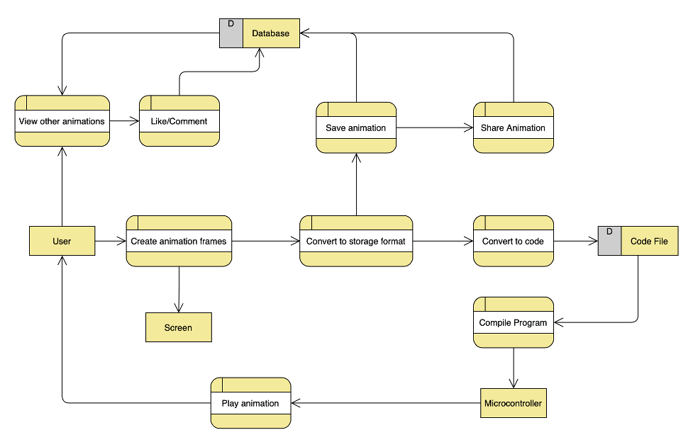

## Entity Relationship Diagram


## Solution Objectives

### Creating Animations

#### The solution must allow users to choose which microcontroller (BBC Micro:Bit or Arduino) and which LED matrix they wish to use. [Core]

This is an essential part of creating an animation, as well as generating the code for an animation. When it comes to creating an animation, the user must be able to select an LED matrix, or select custom dimensions if their matrix isn’t listed. When it comes to generating the code for animation, the user must be able to select their microcontroller, as well as their LED matrix, so that the correct code can be generated.

#### The solution should allow users to choose which language they want the code output to be written in where possible. [Core]

This is a nice feature to have for microcontrollers such as the BBC Micro:Bit or the Raspberry Pi Pico, which both support more than one programming language. For the BBC Micro:Bit, both TypeScript and MicroPython are supported, for the Raspberry Pi Pico, both MicroPython and C++ are supported, and for the Arduino, only C++ is supported.

#### The solution must output the appropriate, functioning code for the selected microcontroller and LED matrix, with documentation where possible. [Core]

It is of course, essential that the code provided to the user is completely functional. In cases where the user needs to connect wires to specific output pins, the code should be commented to explain exactly which pins need to be connected to what.

#### The solution could provide users with large, clearly labelled circuit diagrams where needed. [Extension]

Circuit diagrams would allow users to easily see how to connect their LED matrix to their microcontroller. This is not an essential feature to have, as the code comments will tell a user exactly which pins need to be connected to what anyway.

#### The solution could allow users to download the output code and/or binary files. [Extension]

The ability to download the output code as a binary file would be more convenient in many cases, as it would remove the need for the user to compile their code before it can be used on a microcontroller.

#### The solution should provide an animation timeline to allow easy editing of animations. [Core]

A timeline allows user to see how long their animation is and what order the frames are in. It could also allow users to rearrange the frames, copy the frames, and delete the frames.

#### The solution could provide a library of premade animations for users to use as examples. [Extension]

Examples are great way for younger students to learn what they can do with the site. This is not essential but could be a nice touch.

#### The solution should provide an emulator to show the animations without needing a microcontroller to hand. [Core]

This feature makes it much easier to create and share animations, as it means you do not need to keep compiling and uploading new code to view an animation. It also means that the website can be used by people who do not have any access to a microcontroller.

### Social Aspect

#### The solution must allow users to follow other specific users. [Core]

As the site is intended to make younger students more engaged in their lessons, this feature is very important. Students are likely to be much more engaged when they are able to see what their classmates are getting up to.

#### The solution must allow users to view content shared by the users they follow. [Core]

Viewing another user’s animations can provide entertainment as well as inspiration to a student who is trying to create an animation themselves.

#### The solution must allow users to post comments on each other’s shared work. [Core]

This is a great way for someone to provide feedback to their classmates/students, and makes users feel more connected while they are using the site.

#### The solution should allow users to like each other’s shared work. [Core]

This is quicker and easier way to provide feedback that by leaving a comment.

#### The solution should allow users to view all shared content from a specific user in a profile page. [Core]

Viewing a profile page can be a much nicer way to see what one user has created, rather than trying to scroll through a long feed of posts from multiple different users.

#### The solution could allow users to pin specific posts to the top of their profile page. [Extension]

This would be a nice way for a user to showcase the work that they are most proud of, but it is not an essential feature.

### Classes

#### The solution must allow teachers to set assignments for students to complete. [Core]

This allows the site to be used for classwork, rather than just for students to mess around. It orients the site towards a more educational purpose.

#### The solution must provide a chat room for each class to communicate via. [Core]

A chat section is a great way for students and teachers to easily communicate with one another. In light of recent events causing students to spend a great deal of time at home during their studies, a feature like this is more beneficial than ever.

#### The solution could provide users with the ability to upload attachments to the class chat. [Extension]

This is not a required feature but would provide a more complete experience for users while using the chat room.

#### The solution must allow teachers to moderate the chat to keep it safe and appropriate for students. [Extension]

This feature is again not required, but would make the system much safer, and would make teachers feel far more comfortable allowing their students to use it.

#### The solution must allow teachers to add and remove members of the class. [Core]

This is important as it means students can’t join classes that they are not supposed to, and it means that teachers can remove students if necessary, for example, if that user creates a new account, or simply stops being a member of the class.

#### The solution should provide a page to view all recent posts from a class. [Extension]

This is certainly not required, as users will be able to view activity from class members by simply viewing their profiles, but it may be beneficial, especially for teachers, to be able to see what a class has been getting up to as a whole.

### User Interface

#### The solution must be easy to use and navigate for both experienced users (teachers) and inexperienced users (students). [Core]

As the site will be used by people with a range of abilities when it comes to using computers, it is important that the site is easy to navigate for everyone.

#### The solution should allow common and intuitive interface methods such as drag and drop where appropriate. [Core]

Drag and drop is a nice feature to have as it is often the most intuitive way to complete many tasks.

#### The solution should only allow access to the correct parts of the site for the correct users. [Core]

This is essential to prevent users from accessing pages like the admin page, which could allow a user to cause a great deal of damage by deleting accounts.

### Database

#### The solution must ensure that the database complies with The Data Protection Act by not allowing any unauthorised access. [Core]

This means that data must be kept securely, accurately and with consent of the users in question. The database must not store any unnecessary data.

#### The solution must be able to handle multiple users accessing the database simultaneously. [Core]

This is again essential, as the site must be able to support multiple users at the same time.

## Feasibility of Potential Solutions

### Improving the Current System

The current system, as stated above, is that students simply learn about microcontrollers by reading and following online instructions. This makes the tasks set for students less enjoyable and means that students show less engagement in the subject.

To improve this system, students need to have more enjoyment and engagement in the subject. For ease of use (for both students and teachers) an online solution remains the best option. This allows teachers to easily set work and view students’ progress. It also allows students to see how other students are doing. By creating a social media like aspect in the site, students are likely to be more engaged in what they are doing.

### Possible Technologies

#### C# and Windows Forms

This project could be created using C# and a Windows Forms application. This would provide a familiar experience for Windows users. However, this would result in a solution which can only be created and used on a device running Windows and is therefore not a desirable solution.

#### The chosen solution - Website with PHP

This project will be using primarily PHP to create the backend, although there may be small amounts of JavaScript where appropriate. The solution will be using Object-Orientated Programming wherever possible. Obviously, it will also require use of HTML and CSS (as well as more PHP) to create the user interface. Database access will be handled using SQL. In total, the website will be using at least four, if not five different technologies. When a user creates an animation, code outputs will be available in TypeScript and MicroPython for the BBC Micro:Bit, and C++ for the Arduino and Raspberry Pi Pico.

This solution will be usable by any machine, running almost any operating system, making it a much more desirable solution.

# Design

## Overall System Design

The system can be broken down into three distinct parts.

The first part is creating animations, this is the main part of the project and will consist of an animation editor and the code output for the various supported microcontrollers.

The second part is the social media site which will consist of user profiles and feeds. This will allow users to share the animations they create and get feedback from other users.

The third and final part is the classes which will allow teachers to set assignments for their students and will provide a chat section for class members.

### Creating Animations

Creating an animation will require several different interfaces which are outlined below.

#### Creating Each Frame

The first interface needed will be a representation of the selected LED matrix. Different matrices will require slightly different interfaces. For a monochromatic matrix, users will simply need to select which LEDs are on, but for an RGB matrix, users will be able to select a hexadecimal value for each LED. To provide a faster experience for users, they will be able to copy and paste the same settings for different LEDs.

#### Creating The Full Animation

The next interface that will be required is a timeline. This will allow the user to rearrange and duplicate their animation frames. It will also allow users to view playback before saving their animation.

### Social Media

The second part of this project is the social media aspect of the site. This will be made up of user profiles and a user’s feed.

#### User Profiles
The user profile is a page which allows you to see all posts made by a user in one place. In order to keep this page easy to navigate, it will follow the same design as other social media sites. There will be a header, showing the user’s username, profile picture and bio. Below that, will be feed showing every post made by that user.

#### User Feeds

There are two types of feeds; one appears on each user’s profile and shows only that user’s posts, the other shows posts made by all other users being followed by that user. A feed is simply a scrollable list of images, showing who posted it and with a comments section below each image. Posts are sorted with the newest posts at the top.

### Classes

The final part of this project is the educational aspect. This will allow teachers to communicate with their students and set them tasks. A class will have access to a chat section, and an assignment section.

#### Class Chat

This will be a fairly basic page. All it needs is an input box, and an output section. The input will allow users to send messages, while the output will show a real-time list of messages, with the newest at the bottom.

For a teacher, this page will have a few more features. Teachers will have the ability to moderate the chat, by deleting messages. This can be achieved by right clicking a message, then deleting it.

#### Assignments

This page is another basic one. All it will show is a list of current and past assignments. Each assignment will have a title, a description and a deadline. As well as this, students will have a checkbox to allow them to keep track of which tasks they have completed already.

## Inputs, Processes and Outputs

### Inputs

A majority of the programs inputs will come from a MySQL database. The objects stored in the database are outlined below.

<table>
<thead>
<tr class="header">
<th><strong>Input</strong></th>
<th><strong>Description</strong></th>
<th><strong>Data</strong></th>
</tr>
</thead>
<tbody>
<tr class="odd">
<td>User</td>
<td>This object represents any user of the system (students and teachers). There may be small variations for teachers and students such as the access level.</td>
<td><p>User ID</p>
<p>Username</p>
<p>Password</p>
<p>Access Level</p>
<p>Posts</p></td>
</tr>
<tr class="even">
<td>Post</td>
<td>This object represents a shared animation. These will be displayed in user feeds and on user profiles.</td>
<td><p>Post ID</p>
<p>Timestamp</p>
<p>Animation</p>
<p>Comments</p>
<p>Likes</p></td>
</tr>
<tr class="odd">
<td>Animation</td>
<td>This object represents an animation. The formatting of each frame is outlined below.</td>
<td><p>Animation ID</p>
<p>Matrix Size</p>
<p>Frames</p></td>
</tr>
</tbody>
</table>

## Hardware Requirements

### Memory Capacity

As this program is designed to create programs for microcontrollers, we must consider the storage capacity of an Arduino and a BBC Micro:Bit, as well as the potential file sizes produced by an animation.

#### Arduino

The Arduino has three types of memory:

-   Flash memory, which is where the program is stored. This is non-volatile, so will retain its data when the Arduino loses power.

-   SRAM, which is where the program’s variables are stored and manipulated. This is volatile, so will lose its data when the Arduino loses power.

-   EEPROM, which is another non-volatile memory store which acts as an on-board hard drive.

For the Arduino Uno, the memory capacities are as follows:

| **Flash**  | 32KB (0.5KB used for the bootloader) |
|------------|--------------------------------------|
| **SRAM**   | 2KB                                  |
| **EEPROM** | 1KB                                  |

For the Arduino Mega, there is a larger memory capacity:

| **Flash**  | 256KB (8KB used for the bootloader) |
|------------|-------------------------------------|
| **SRAM**   | 8KB                                 |
| **EEPROM** | 4KB                                 |

#### BBC Micro:Bit

Unlike the Arduino, the Micro:Bit only has two types of memory:

-   Flash memory, to store the program. This is non-volatile.

-   SRAM, to store and manipulate the program variables. This is volatile.

The memory capacities for the BBC Micro:Bit v1 are as follows:

| **Flash** | 256KB |
|-----------|-------|
| **SRAM**  | 16KB  |

The memory capacities for the BBC Micro:Bit v2 are as follows:

| **Flash** | 512KB |
|-----------|-------|
| **SRAM**  | 128KB |

This means that the BBC Micro:Bit has the most memory to work with, although it is still important to consider that animations should be able to run on both Arduinos and Micro:Bits, so should not exceed the memory capacity of an Arduino.

### Reducing Animation Sizes

The amount of memory taken up by an animation depends entirely upon how it is compressed.

When using TypeScript or Python to program the Micro:Bit, LEDs can be controlled with many different methods. The most important of these for this project are led.plot(x, y) and basic.clearScreen(). Using these methods, it is possible to switch on each LED needed for a frame in an animation then clear the matrix before the next frame.

Using these methods, there are many options for how an animation can be represented before being displayed.

One possible method of storing an animation would be to use the same system as the basic.showLEDs() method. This uses a string to show which LEDs should be on and which should be off. For example:

\# . . . #

. # . # .

. . # . .

. # . # .

\# . . . #

In this string, each # represents an LED which is on, and each . represents an LED which is off. The advantage of this method is that it makes it very easy to see what an animation looks like before running it. The disadvantage of this is that it’s a very poor use of memory. The amount of memory used by a string is dependent upon its length; this string is 49 characters long (including the spaces and new lines) and each character uses 8 bits of memory, meaning this string would use up 49 * 8 = 392 bits of memory. If each frame were to use 392 bits, a short animation of 24 frames (which would be 1 second long using a standard framerate of 24 frames per second) would use 392 * 24 = 9408 bits or 9.4kB. The memory usage could be reduced by not using and spaces or new lines. The string would then be: #...#.#.#...#...#.#.#...#. In this case, as the string is now only 25 characters, it would use 25 * 8 = 200 bits of memory. As such, as 24 frame animation would use 200 * 24 = 4800 bits or 4.8kB.

An alternative method of storing an animation without using up too much memory, would be to store each frame as a single number. Given a 5x5, monochromatic, single brightness LED matrix, a frame could be represented by a 25-bit number, where each bit represents one LED. In reality, the numbers stored in memory would be stored as 32-bit integers, however this still uses far less memory than a string would. For a 24-frame animation, only 32 * 24 = 768 bits would be used. This is less that 1kB, meaning the amount of memory used is only around 20% of the memory used by a string. As well as using far less memory, this method would be easier to work with, as using only a few bitwise operators would provide all the information needed to determine which LEDs should be on or off. Unlike the previous method, this one can be easily adapted to support variable brightness and RGB LED matrices. For a variable brightness, monochromatic animation, each LED could be represented by 8 bits, allowing variations in brightness from 0 to 255. Likewise, for an RGB animation, each LED would be stored as 3 8-bit numbers, allowing for a full range of colours. This would mean that a short 24-frame animation (using a 5x5 RGB matrix) would use 5 * 5 * 8 * 3 = 600 bits per frame, and 600 * 24 = 14400 bits or 14.1kB in total. Although this is more memory that was used by a string in the example above, this does provide a much wider range of colour, which would not be possible using a string. There is, however, a problem here; to store each frame of an RGB 5x5 animation as a single number would require 600-bit numbers, which cannot be stored on a computer as integers are usually stored in 32 bits. As such, a single frame would need to be stored as more than one number. In this case, each number could be split into several 32-bit numbers which can be grouped in an array. Using this method, each 600-bit number would be stored as an array containing 600 / 32 = 18.75 32-bit numbers which rounds up to 19 32-bit numbers (obviously you cannot have 0.75 of a number, but the one 24-bit number would still be stored using 32 bits).

## Object Representation

### UML Diagram


This diagram shows the connections between each class that will be used in this project.

More information about each class can be found bellow.

### Database

This class allows for straight forward communication with the MySQL database which stores all of the website’s data. An instance of this class is created and stored in each user’s session.

The properties dbHost, dbName, dbPassword and dbUser are used to log in to the correct database.

The property mysqli stores an instance of the mysqli class which is built into PHP.

The delete, insert, select and update methods construct and execute an appropriate SQL statement to query the database.


### User


### Animation


### AdaFruit16x9Animation


### AdaFruitNeoPixel8x8Animation


### LolShieldAnimation

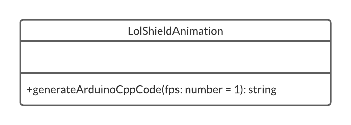

### PicoRGBKeypadAnimation


### ScrollBitAnimation


### Frame


### Matrix


### AnimationEditor


### MonochromaticAnimationEditor


### VariableBrightnessAnimationEditor


### RGBAnimationEditor


### Group


### Message


### Assignment


### AssignmentWork


### Post


### Comment


## Database

A database is the core of a website and is therefore essential to this project.

### Initial Ideas

Below are the initial ideas for how the database might look:

**User**(<u>Username</u>, PasswordHash, Bio, Type, FollowingIDs, FollowerIDs, AnimationIDs, PostIDs)

**Animation**(<u>AnimationID</u>, Frames, Width, Height, Type)

**Class**(<u>ClassID</u>, Name, TeacherUsernames, StudentsUsernames, AssignmentIDs, ChatEnabled, MutedUsernames)

**Assignment**(<u>AssignmentID</u>, Description, CreatedAt, DueAt, WorkIDs)

**AssignmentWork**(<u>WorkID</u>, Username, CreatedAt, AnimationID)

**ChatMessage**(<u>MessageID</u>, Username, ClassID, Content, CreatedAt)

**Post**(<u>PostID</u>, CommentIDs, LikeIDs, AnimationID, CreatedAt, FPS)

**Comment**(<u>CommentID</u>, Username, Content, CreatedAt)

### Normalisation

The process of normalising a database is done to ensure that there is no duplicate data being stored. The criteria for normalising a database include that data must be atomic, meaning only one value is stored in each field of each row in a table.

One of the biggest problems with the design shown above is that a lot of the data is not atomic. To get around this problem, extra tables can be created which would provide links between one table and another, or certain table fields could be moved to another table. For example, instead of having the CommentIDs field in the Post table, the Comment table could have a PostID field and instead of the Post table having the LikeIDs field, a Like table could be created which could serve as a link between a PostID and a Username.

**User**(<u>Username</u>, PasswordHash, Bio, Type)

**UserFollowing**(Username, FollowingUsername)

**Animation**(<u>AnimationID</u>, Username, Width, Height, Type)

**Frame**(<u>FrameID</u>, AnimationID, FramePosition, RepeatCount, BinaryString)

**Class**(<u>ClassID</u>, Name, ChatEnabled)

**ClassMember**(ClassID, Username)

**Assignment**(<u>AssignmentID</u>, ClassID, Description, CreatedAt, DueAt)

**AssignmentWork**(<u>WorkID</u>, AssignmentID, Username, AnimationID, CreatedAt)

**ChatMessage**(<u>MessageID</u>, Username, ClassID, Content, CreatedAt)

**MutedUser**(ClassID, Username)

**Post**(<u>PostID</u>, Username, AnimationID, CreatedAt, FPS)

**Comment**(<u>CommentID</u>, PostID, Username, Content, CreatedAt)

**PostLike**(PostID, Username)

### Entity Relationship Diagram


## Graphical User Interface

The GUI is how all users will interact with this website. As such, it needs to be appropriate for both students and teachers.

### Home Page

This page is the first to be seen when accessing the website. Upon logging in, the home page will display the user’s feed.


1.  Displays your profile picture and username. Links to your profile page.

2.  Lists your classes. Each box would show the class name and would link to the class page.

3.  Lists your projects. Each box would show the project name and would link to the project editor.

4.  The user’s feed. Shows a list of posts.

    1.  Shows who made the post.

    2.  Shows the animation itself.

    3.  Controls which allow you to like/comment.

    4.  Shows the comments.

### Animation Editor

This page provides the interface for creating and editing animations.


1.  A timeline to show the full animation. Each frame can be selected then edited individually. When a frame is selected, it can be copied/pasted and can be stretched to repeat.

2.  A preview to show the current position in the timeline. You can play and pause the animation at any point.

3.  A projects list to provide quick access to all saved projects.

4.  A frame editor to allow you to edit each individual frame. You can select one or more LEDs at once then use the colour sliders to set the colour.

5.  For RGB: a red, a green and a blue slider to edit each LED. For variable brightness: a single slider to edit the brightness between 0 and 255. For monochromatic: an on/off toggle.

6.  A new frame button to add new frames to the animation.

7.  A download button which will allow you choose which microcontroller to download the code for.

8.  A share button which will allow you to post the animation on your timeline.

### User Profile

This page displays information about a specific user. It provides a feed of only that user’s posts, it shows the profile picture for that user, the username for that user and a bio for that user.


1.  Shows the user’s profile picture.

2.  Shows some information about the user. X Y and Z are numbers.

3.  Allows you to edit your profile (only appears when viewing your own profile).

4.  Shows a grid of the user’s posts.

### Class View

This page will appear slightly differently depending upon who is using it. Teachers will be able to delete messages from any user, whereas a student will only be able to delete their own messages. Teachers will also be able to set assignments and view the work students hand in.


1.  Button to show the chat.

2.  Button to show the assignments.

3.  Chat section, automatically scrolls as new messages come in.

4.  Text box to send messages.

5.  Class member list.

## File Structure

The file structure for this website will be quite straight forward and will ensure that all files can be easily navigated.

A few files will be stored in the root of the directory. These files include index.php, .htaccess, and any configuration files. The .htaccess file will redirect all requests to the index.php file, which will then import all required classes, and will handle all page routing.

There will be a folder to contain all classes which are to be used in the project. Within this classes folder will be a PHP folder, a TypeScript folder and a JavaScript folder. Most classes will be written in PHP and so will be stored in the PHP folder. The classes which govern the behaviour of the animation editor will be written in TypeScript and stored in the corresponding folder. These classes will be compiled into JavaScript and will once again be stored in the appropriately named folder. The database class will be stored in a separate folder to the others.

Any CSS created for this website will be stored in a CSS folder, meanwhile, there will be a Pages folder, which will hold the PHP files for each page on the site. Certain files will also be stored in an Include folder. These files will all be .inc files and will contain HTML or PHP which may need to be imported into other files, often more than once. These files will include a header.inc file, a footer.inc file and a redirect.inc file, as well as a few others.

Finally, there will be a Utils folder which will contain two more folders, a Functions folder, and a Forms folder. The Functions folder will contain PHP functions used for mapping and sorting arrays, while the Forms folder will contain many PHP files, which will be run be AJAX requests throughout the website. These AJAX requests provide a better user experience that standard HTML forms, as they execute code in the background, so do not require the page to refresh.

## Algorithms

### Animation Rendering Algorithms

The following algorithms show how a microcontroller will be able to render an animation on an LED matrix of any size.

For each of the following algorithms, the width variable refers to the width of the LED matrix, the height variable refers the height of the LED matrix, the fps variable refers to how many frames should be rendered each second and the animation variable refers to a 2-dimensional array which stores each frame of the animation. The sleep function will make the program pause for the given number of milliseconds, the plot function will switch an LED on at the given coordinates and with the given colour/brightness value where appropriate, and the clear function will switch off every LED on the matrix.

#### Monochromatic Animations

A monochromatic animation is stored as a 2-dimensional array. Each item in this array is an array of 32-bit numbers, which, when properly combined, represent a full frame. For a monochromatic animation, each bit represents the state of a single LED. This means that each number represents up to 32 LEDs.

The problem which can arise with this solution, is that the number of LEDs in a single frame might not be a multiple of 32, in which case the first number in each array will be representing less than 32 LEDs. This problem is overcome by simply checking if the number of LEDs is a multiple of 32, then running a slightly different algorithm accordingly.
```
IF width * height % 32 == 0 THEN
    FOR i = 0 TO len(animation) – 1 LOOP
        bits = [width * height]
        FOR j = 0 TO width * height / 32 - 1 LOOP
            FOR k = 0 TO 31 LOOP
                bits[j * 32 + k] = animation[i][j] >> 31 - k & 1
            END FOR
        END FOR
        FOR j = 0 TO width * height - 1 LOOP
            x = j % width
            y = j // width
            plot(x, y, bits[j])
        END FOR
        sleep(1000 / fps)
        clear()
    END FOR
ELSE
    FOR i = 0 TO len(animation) - 1 LOOP
        bits = [width * height]
        FOR j = 0 TO width * height % 32 - 1 LOOP
            bits[j] = animation[i][0] >> width * height % 32 - 1 - j & 1
        END FOR
        FOR j = 0 TO (width * height - width * height % 32) / 32 - 1 LOOP
            FOR k = 0 TO 31 LOOP
                bits[width * height % 32 + j * 32 + k] = animation[i][j + 1] >> 31 - k & 1
            END FOR
        END FOR
        FOR j = 0 TO width * height - 1 LOOP
            x = j % width
            y = j // width
            plot(x, y, bits[j])
        END FOR
        sleep(1000 / fps)
        clear()
    END FOR
END IF
```
#### Variable Brightness Animations

A variable brightness animation is stored as a 2-dimensional array. Each item in this array is an array of 32-bit numbers, which, when properly combined, represent a full frame. For a variable brightness animation, 8 bits represents the state of a single LED. This means that each number represents up to 4 LEDs.

The problem which can arise with this solution, is that the number of LEDs in a single frame might not be a multiple of 4, in which case the first number in each array will be representing less than 4 LEDs. This problem is overcome by simply checking if the number of LEDs is a multiple of 32, then running a slightly different algorithm accordingly.
```
IF width * height % 4 == 0 THEN
    FOR i = 0 TO len(animation) - 1 LOOP
        bits = [width * height]
        FOR j = 0 TO width * height / 4 - 1 LOOP
            FOR k = 0 TO 3 LOOP
                bits[j * 4 + k] = animation[i][j] >> (3 - k) * 8 & 255
            END FOR
        END FOR
        FOR j = 0 TO width * height - 1 LOOP
            x = j % width
            y = j // width
            plot(x, y, bits[j])
        END FOR
        sleep(1000 / fps)
        clear()
    END FOR
ELSE
    FOR i = 0 TO len(animation) - 1 LOOP
        bits = [width * height]
        FOR j = 0 TO width * height % 4 - 1 LOOP
            bits[j] = animation[i][0] >> width * height % 4 - 1 - j & 255
        END FOR
        FOR j = 0 TO (width * height - width * height % 4) / 4 - 1 LOOP
            FOR k = 0 TO 3 LOOP
                bits[width * height % 4 + j * 4 + k] = animation[i][j + 1] >> (3 - k) * 8 & 255
            END FOR
        END FOR
        FOR j = 0 TO width * height - 1 LOOP
            x = j % width
            y = j // width
            plot(x, y, bits[j])
        END FOR
        sleep(1000 / fps)
        clear()
    END FOR
END IF
```
#### RGB Animations

An RGB animation is stored as a 2-dimensional array. Each item in this array is an array of 24-bit numbers, which, when properly combined, represent a full frame. For an RGB animation, 24 bits represents the state of a single LED. This means that each number represents 1 LED.

It would be possible to compress the animation slightly by taking advantage of the full 32 bits available in a number. However, as a single LED requires 24 bits, and 24 is not a factor of 32, the process of extracting the relevant information for a single LED would be overly complicated.
```
FOR i = 0 TO len(animation) - 1 LOOP
    bits = [width * height]
    FOR j = 0 TO width * height - 1 LOOP
        bits[j][0] = animation[i][j] >> 16 & 255
        bits[j][1] = animation[i][j] >> 8 & 255
        bits[j][2] = animation[i][j] & 255
    END FOR
    FOR j = 0 TO width * height - 1 LOOP
        x = j % width
        y = j // width
        plot(x, y, bits[j][0], bits[j][1], bits[j][2])
    END FOR
    sleep(1000 / fps)
    clear()
END FOR
```
### Bitmap Graphic Algorithms

The following algorithms are used when a user is creating an animation.

#### Bresenham’s Straight Line Algorithm

This algorithm calculates all the coordinates of a straight line on a grid by taking the x and y coordinates of the start and end of the line.
```
FUNCTION bresenhamLine(x0, y0, x1, y1)
    coordsList = []

    FUNCTION plotLineLow(x0, y0, x1, y1)
        dx = x1 – x0
        dy = y1 – y0
        yi = 1

        IF dy < 0 THEN
            yi = -1
            dy = -dy
        END IF

        D = 2 * dy – dx
        y = y0

        FOR x = x0 TO x1 LOOP
            coordsList.push([x, y])
            IF D > 0 THEN
                y = y + yi
                D = D + 2 * (dy – dx)
            ELSE
                D = D + 2 * dy
            END IF
        END FOR
    END FUNCTION

    FUNCTION plotLineHigh(x0, y0, x1, y1)
        dx = x1 – x0
        dy = y1 – y0
        xi = 1

        IF dx < 0 THEN
            xi = -1
            dx = -dx
        END IF

        D = 2 * dx – dy
        x = x0

        FOR y = y0 TO y1 LOOP
            coordsList.push([x, y])
            IF D > 0 THEN
                x = x + xi
                D = D + 2 * (dx – dy)
            ELSE
                D = D + 2 * dx
            END IF
        END FOR
    END FUNCTION

    IF abs(y1 – y0) < abs(x1 – x0) THEN
        IF x0 > x1 THEN
            plotLineLow(x1, y1, x0, y0)
        ELSE
            plotLineHigh(x0, y0, x1, y1)
        END IF
    ELSE
        IF y0 > y1 THEN
            plotLineHigh(x1, y1, x0, y0)
        ELSE
            plotLineHigh(x0, y0, x1, y1)
        END IF
    END IF

    RETURN coordsList
END FUNCTION
```
#### Drawing a Border

This algorithm determines the coordinates of the LED which should be switched on to draw a border around the matrix.

This algorithm is extremely straight forward. To draw a one-pixel thick border, the coordinates of each activated pixel must have an x-coordinate of 0, a y-coordinate of 0, an x-coordinate of the width of the matrix subtract one or a y-coordinate of the height of the matrix subtract one.
```
FUNCTION DrawBorder
    coordsList = []
    FOR y = 0 TO height – 1 LOOP
        FOR x = 0 TO width – 1 LOOP
            validX = x == 0 || x == width – 1
            validY = y == 0 || y == height – 1
            IF validX || validY THEN
                coordsList.push([x, y])
            END IF
        END FOR
    END FOR
    RETURN coordsList
END FUNCTION
```
#### Drawing a Cross

This algorithm determines the coordinates of the LED which should be switched on to draw a cross on the matrix.

This algorithm is also very straight forward, although is slightly more complex that it may seem at first. In order to draw a cross on a square matrix, the coordinates of each activated LED must either be of the form y = x or y = height – x (these come from the cartesian equations y = x and y = -x but are adjusted to account for the fact the (0, 0) is in the top left corner, not the centre of the matrix). However, for this algorithm to work with a matrix of any size, we must take advantage of the Bresenham’s straight line algorithm from above.
```
FUNCTION DrawCross
    coordsList = []
    leadingDiagonal = bresenhamLine(0, 0, width – 1, height – 1)
    nonLeadingDiagonal = bresenhamLine(width – 1, 0, 0, height – 1)
    coordsList = leadingDiagonal + nonLeadingDiagonal
    RETURN coordsList
END FUNCTION
```
#### Drawing a Plus

This algorithm determines the coordinates of the LED which should be switched on to draw a plus on the matrix.

Once again, this algorithm is nothing special. It simply finds the coordinates which lie in the centre, both horizontally and vertically. If the width or height are even, the vertical or horizontal lines respectively, will be 2 pixels thick.
```
FUNCTION DrawPlus
    coordsList = []
    FOR y = 0 TO height – 1 LOOP
        FOR x = 0 TO width – 1 LOOP
            validX = x == width // 2 || x == (width – 1) // 2
            validY = y == height // 2 || y == (height – 1) // 2
            IF validX || validY THEN
                coordsList.push([x, y])
            END IF
        END FOR
    END FOR
    RETURN coordsList
END FUNCTION
```
#### Drawing a Circle (Square matrices only)

This algorithm determines the coordinates of the LED which should be switched on to draw a circle on the matrix.

This algorithm is ever so slightly more complex but is still incredibly simple. It uses the Pythagorean theorem to find the distance that a point is from the centre of the matrix, then compares that to the left of the radius.
```
FUNCTION DrawCircle
    coordsList = []
    size = min(width, height)
    radius = size // 2
    FOR y = 0 TO height – 1 LOOP
        FOR x = 0 TO width – 1 LOOP
            xDistance = 0
            yDistance = 0
            IF size % 2 == 0 THEN
                xDistance = radius – x – 0.5
                yDistance = radius – y – 0.5
            ELSE
                xDistance = radius – x
                yDistance = radius – y
            END IF
            distance = round(sqrt(xDistance ** 2 + yDistance ** 2))
            IF distance == radius THEN
                coordsList.push([x, y])
            END IF
        END FOR
    END FOR
    RETURN coordsList
END FUNCTION
```
#### Drawing a filled in Circle (Square matrices only)

This algorithm determines the coordinates of the LED which should be switched on to draw a filled in circle the matrix.

This algorithm is almost identical to the one above, except it checks to see if the distance is less than or equal to the radius rather than just equal to.
```
FUNCTION DrawCircle
    coordsList = []
    size = min(width, height)
    radius = size // 2
    FOR y = 0 TO height – 1 LOOP
        FOR x = 0 TO width – 1 LOOP
            xDistance = 0
            yDistance = 0
            IF size % 2 == 0 THEN
                xDistance = radius – x – 0.5
                yDistance = radius – y – 0.5
            ELSE
                xDistance = radius – x
                yDistance = radius – y
            END IF
            distance = round(sqrt(xDistance ** 2 + yDistance ** 2))
            IF distance <= radius THEN
                coordsList.push([x, y])
            END IF
        END FOR
    END FOR
    RETURN coordsList
END FUNCTION
```
#### Drawing a No-Entry Sign (Square matrices only)

This algorithm determines the coordinates of the LED which should be switched on to draw a no-entry sign the matrix.

This algorithm is exactly the same as the unfilled circle algorithm, but also finds the coordinates of the leading diagonal line. As this algorithm is only available for square matrices, this is done by simply checking if the x-coordinate equals the y-coordinate.
```
FUNCTION DrawCircle
    coordsList = []
    size = min(width, height)
    radius = size // 2
    FOR y = 0 TO height – 1 LOOP
        FOR x = 0 TO width – 1 LOOP
            xDistance = 0
            yDistance = 0
            IF size % 2 == 0 THEN
                xDistance = radius – x – 0.5
                yDistance = radius – y – 0.5
            ELSE
                xDistance = radius – x
                yDistance = radius – y
            END IF
            distance = round(sqrt(xDistance ** 2 + yDistance ** 2))
            IF (x == y && distance <= radius) || distance == radius THEN
                coordsList.push([x, y])
            END IF
        END FOR
    END FOR
    RETURN coordsList
END FUNCTION
```
### Matrix Algorithms

The following algorithms are used to carry out various calculations using matrices.

#### Creating a 2-dimensional array of 0s

This simple algorithm is a helpful starting point for creating matrices.
```
FUNCTION create0Array (width, height)
    A = []
    FOR i = 0 TO height – 1 LOOP
        A[i] = []
        FOR j = 0 TO width – 1 LOOP
            A[i][j] = 0
        END FOR
    END FOR
    RETURN A
END FUNCTION
```
#### Creating the identity matrix

The identity matrix is a square matrix made up of 0s, with 1s on the leading diagonal. When a matrix is multiplied by the identity matrix, it has the result of keeping the original matrix the same. It is the equivalent of multiplying a number by 1.
```
FUNCTION createIdentity (size)
    M = []
    FOR i = 0 TO size – 1 LOOP
        M[i] = []
        FOR j = 0 TO size – 1 LOOP
            IF i == j THEN
                M[i][j] = 1
            ELSE
                M[i][j] = 0
            END IF
        END FOR
    END FOR
    RETURN M
END FUNCTION
```
#### Transposing a matrix

Transposing a matrix is just a fancy way of saying “reflect the matrix across the leading diagonal”. Transpositions only exist for square matrices.
```
FUNCTION getTransposition (matrix)
    M = []
    FOR i = 0 size(matrix) LOOP
        M[i] = []
        FOR j = 0 to size(matrix) LOOP
            M[i][j] = matrix[j][i]
        END FOR
    END FOR
    RETURN M
END FUNCTION
```
#### Getting the cofactors of a matrix

The cofactors of a matrix are used when calculating the inverse of a matrix. Finding the cofactors of a matrix is as simple as creating a checker board pattern of + and – (starting with a + in the top left) and applying that to the numbers in the matrix. The cofactors of a matrix are only useful for square matrices.
```
FUNCTION getCofactors (matrix)
    M = []
    FOR i = 0 TO size(matrix) – 1 LOOP
        M[i] = []
        FOR j = 0 TO size(matrix) – 1 LOOP
            M[i][j] = pow(-1, i + j)
        END FOR
    END FOR
    RETURN M
END FUNCTION
```
#### Getting the minors of a matrix

Matrix minors are used when calculating the determinant and inverse of a matrix. To find the minor of a matrix, you must go through each value in the matrix, cover that value’s row and column, then calculate the determinant of the remaining matrix. A matrix of minors is a matrix that is created from the minors of another matrix, this is used when calculating the inverse of a matrix.
```
FUNCTION getMinor (matrix, row, column)
    M = []
    FOR i = 0 TO size(matrix) – 2 LOOP
        M[i] = []
        FOR j = 0 TO size(matrix – 2) LOOP
            xCoord = i
            yCoord = j
            IF i >= row THEN
                xCoord = i + 1
            END IF
            IF j >= column THEN
                yCoord = j + 1
            END IF
            M[i, j] = matrix[xCoord, yCoord]
        END FOR
    END FOR
    RETURN getDeterminant(M)
END FUNCTION
```
#### Finding the determinant of a matrix

The determinant of a matrix is a scalar value that is a function of a matrix. The determinant can only be found for a square matrix. For 2x2 or 3x3 matrices, the determinant can be found quite easily, but the process would take far too long for any larger matrices. The following algorithm is efficient for any size.
```
FUNCTION getDeterminant (matrix)
    IF size(matrix) == 2 THEN
        RETURN matrix[0][0] * matrix[1][1] – matrix[0][1] * matrix[1][0]
    END IF
    M = []
    FOR i = 0 TO width(matrix) – 1 THEN
        M[i] = []
        FOR j = 0 TO height(matrix) – 1 THEN
            M[i][j] = getCofactors(matrix)[i][j] * getMinor(matrix, i, j)
        END FOR
    END FOR
    det = 0
    FOR EACH x, i IN M[0] LOOP
        det += x * matrix[i][0]
    END FOR
    RETURN det
END FUNCTION
```
#### Finding the adjugate of a matrix

The adjugate of a matrix is the transposition of the cofactor matrix of minors. Basically, you find the matrix of minors, then find the cofactors of that matrix, then transpose that.
```
FUNCTION getAdjugate (matrix)
    T = getTransposition(matrix)
    M = []
    FOR i = 0 TO width(matrix) – 1 LOOP
        M[i] = []
        FOR j = 0 TO height(matrix) – 1 LOOP
            M[i][j] = getCofactors(matrix)[i][j] * getMinor(T, i, j)
        END FOR
    END FOR
    RETURN M
END FUNCTION
```
#### Finding the inverse of a matrix

The inverse of a matrix is another matrix, such that the original matrix, multiplied by its inverse is equal to the identity matrix. The inverse can be found by multiplying the adjugate by 1/the determinant.
```
FUNCTION getInverse (matrix)
    D = getDeterminant(matrix)
    M = getAdjugate(matrix)
    FOR i = 0 TO width(matrix) – 1 LOOP
        FOR j = 0 TO height(matrix) – 1 LOOP
            M[i][j] *= 1 / D
        END FOR
    END FOR
    RETURN M
END FUNCTION
```
#### Multiplying a matrix by a scalar value

This process is simple, each value in the matrix is multiplied by the scalar value.
```
FUNCTION scalarMultiply (matrix, scalar)
    M = []
    FOR i = 0 TO width(matrix) – 1 LOOP
        M[i] = []
        FOR j = 0 TO height(matrix) – 1 LOOP
            M[i][j] = matrix[i][j] * scalar
        END FOR
    END FOR
    RETURN M
END FUNCTION
```
#### Multiplying two matrices

Matrix multiplication can only be done if the width of the first matrix must equal the height of the second matrix. It should also be noted that matrix multiplication is not commutative, meaning that for two matrices M and N, MN ≠ NM. Multiplying a matrix by a vector has the same principle as multiplying two matrices.
```
FUNCTION matrixMultiply (left, right)
    M = []
    FOR i = 0 TO height(left) – 1 LOOP
        FOR j = 0 TO width(right) – 1 LOOP
            FOR k = 0 TO width(left) – 1 LOOP
                M[i][j] = left[i][k] * right[k][j]
            END FOR
        END FOR
    END FOR
    RETURN M
END FUNCTION
```
#### Reversing the rows of a matrix
```
FUNCTION reverseRows (matrix)
    M = []
    FOR i = 0 TO width(matrix) – 1 LOOP
        M[i] = []
        FOR j = 0 TO height(matrix) – 1 LOOP
            M[j][i] = matrix[j][width(matrix) – 1 – i)]
        END FOR
    END FOR
    RETURN M
END FUNCTION
```
#### Reversing the columns of a matrix
```
FUNCTION reverseColumns (matrix)
    M = []
    FOR i = 0 TO width(matrix) – 1 LOOP
        M[i] = []
        FOR j = 0 TO height(matrix) – 1 LOOP
            M[j][i] = matrix[height(matrix) – 1 – j][i]
        END FOR
    END FOR
    RETURN M
END FUNCTION
```
#### Rotating a matrix

Rotating a matrix is a simple and useful task when representing an LED matrix as a mathematical matrix.
```
FUNCTION rotate (matrix, angle)
    IF angle == 90 THEN
        RETURN reverseRows(getTransposition(matrix))
    ELSE IF angle == 180 THEN
        RETURN reverseColumns(reverseRows(matrix))
    ELSE IF angle == 270 THEN
        RETURN reverseColumns(getTransposition(matrix))
    END IF
END FUNCTION
```
#### Translate a matrix by 1 pixel in a given direction

This is another helpful function to help users create animations. The process can be achieved my multiplying by a few different matrices.
```
FUNCTION translate (matrix, direction)
    M = []
    IF direction == “left” || direction == “down” THEN
        FOR i = 0 TO width(matrix) – 1 LOOP
            M[i] = []
            FOR j = 0 TO height(matrix) – 1 LOOP
                IF i == j – 1 THEN
                    M[i][j] = 1
                ELSE
                    M[i][j] = 0
                END IF
            END FOR
        END FOR
        IF direction == “left” THEN
            RETURN matrixMultiply(matrix, M)
        ELSE
            RETURN matrixMultiply(M, matrix)
        END IF
    ELSE IF direction == “right” || direction == “up” THEN
        FOR i = 0 TO width(matrix) – 1 LOOP
            M[i] = []
            FOR j = 0 TO height(matrix) – 1 LOOP
                IF i == j + 1 THEN
                    M[i][j] = 1
                ELSE
                    M[i][j] = 0
                END IF
            END FOR
        END FOR
        IF direction == “right” THEN
            RETURN matrixMultiply(matrix, M)
        ELSE
            RETURN matrixMultiply(M, matrix)
        END IF
    END IF
END FUNCTION
```
## Testing Strategy

Every feature of the site must be tested to ensure that it behaves as expected. Testing will be carried out as the program is written to ensure no major bugs can make their way into the final solution. A large testing phase will be carried out after the program is complete, which will test each feature to a deeper level.

This larger testing phase will involve testing expected and unexpected data being input into the website. If and when unexpected behaviour occurs, the problem will be fixed, and retested to ensure that the fix does its job correctly.

Testing must also be carried out to ensure that the code output for each animation works as expected.

Each test will be documented with what is being tested, the kind of input provided, the expected outcome of the test, and the actual outcome of the test.

# Testing

Many pages do not need much testing for this project as all they do it display data. For those pages which require more testing, screenshots will often be redundant, as the expected outcome will simply be successfully displaying data or successfully updating the database.

## Signing Up

| **ID**                                                              | **Description**                                        | **Input**                                                                          | **Expected Output**                                                                                                  | **Actual Output**                                                                                                             |
|---------------------------------------------------------------------|--------------------------------------------------------|------------------------------------------------------------------------------------|----------------------------------------------------------------------------------------------------------------------|-------------------------------------------------------------------------------------------------------------------------------|
| 0                                                                   | Entering valid credentials.                            | An unused username, less than or equal to 32 characters.                           | Successful creation of account and redirect to home page.                                                            |                                                                                                                               |
|  |                                                        |                                                                                    |                                                                                                                      |                                                                                                                               |
| 1                                                                   | Entering a username which is too long.                 | An unused username, more than 32 characters.                                       | Unable to enter more than 32 characters.                                                                             | User was able to enter too many characters. Resulted in a failure to create the account and rendered the wrong page contents. |
| 1.1                                                                 | Entering a username which is too long.                 | An unused username, more than 32 characters.                                       | Unable to enter more than 32 characters and cuts off the username after this length if the user bypasses that limit. |                                                                                                                               |
| 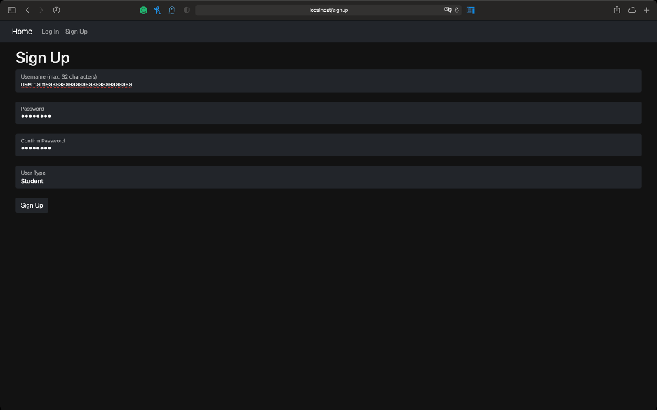 |                                                        |                                                                                    |                                                                                                                      |                                                                                                                               |
| 2                                                                   | Entering a username with spaces or punctuation.        | An unused username, with spaces and/or punctuation.                                | The spaces and/or punctuation cannot be entered and are removed if the user bypasses this.                           |                                                                                                                               |
|  |                                                        |                                                                                    |                                                                                                                      |                                                                                                                               |
| 3                                                                   | Entering a username which is already taken.            | A valid username which has already been used by another user.                      | An error message is displayed to the user, informing them that the username is already taken.                        |                                                                                                                               |
|  |                                                        |                                                                                    |                                                                                                                      |                                                                                                                               |
| 4                                                                   | Entering a different password in the confirmation box. | Two different passwords entered into the password and password confirmation boxes. | An error message is displayed to the user, informing them that the passwords are different.                          |                                                                                                                               |
|  |                                                        |                                                                                    |                                                                                                                      |                                                                                                                               |
| 5                                                                   | Skipping certain input fields.                         | No username, no password or no password confirmation.                              | The form cannot be submitted, and an error message is displayed if the user manages to bypass the form validation.   |                                                                                                                               |
|  |                                                        |                                                                                    |                                                                                                                      |                                                                                                                               |

## Logging In

| **ID**                                                              | **Description**               | **Input**                                          | **Expected Output**                                                   | **Actual Output** |
|---------------------------------------------------------------------|-------------------------------|----------------------------------------------------|-----------------------------------------------------------------------|-------------------|
| 0                                                                   | Entering valid credentials.   | Correct username and password.                     | User is Successfully logged in and redirected to the home page.       |                   |
| 1                                                                   | Entering an invalid username. | A username that does not exist.                    | The user is told that they entered an incorrect username or password. |                   |
|  |                               |                                                    |                                                                       |                   |
| 2                                                                   | Entering an invalid password. | A password that does not match the valid username. | The user is told that they entered an incorrect username or password. |                   |
|  |                               |                                                    |                                                                       |                   |
| 3                                                                   | Not entering a username.      | A password without a username.                     | The user is told that they entered an incorrect username or password. |                   |
|  |                               |                                                    |                                                                       |                   |
| 4                                                                   | Not entering a password.      | A username without a password.                     | The user is told that they entered an incorrect username or password. |                   |
|  |                               |                                                    |                                                                       |                   |

## Admin Controls

| **ID** | **Description**              | **Input**     | **Expected Output**                                                                                       | **Actual Output** |
|--------|------------------------------|---------------|-----------------------------------------------------------------------------------------------------------|-------------------|
| 0      | Resetting a user’s password. | Button press. | The user’s password is set to be the same as their username, allowing them to change it when they log in. |                   |
| 1      | Making a user an admin.      | Button press. | The user’s account is switched to an admin account.                                                       |                   |
| 2      | Deleting objects.            | Button press. | The object is deleted from the database, and all related objects are also deleted.                        |                   |

## Profile Page

<table>
<thead>
<tr class="header">
<th><strong>ID</strong></th>
<th><strong>Description</strong></th>
<th><strong>Input</strong></th>
<th><strong>Expected Output</strong></th>
<th><strong>Actual Output</strong></th>
</tr>
</thead>
<tbody>
<tr class="odd">
<td>0</td>
<td>Viewing a user’s followers.</td>
<td>Link clicked.</td>
<td>Displays a list of users with links to their profiles.</td>
<td></td>
</tr>
<tr class="even">
<td></td>
<td></td>
<td></td>
<td></td>
<td></td>
</tr>
<tr class="odd">
<td>1</td>
<td>Viewing who a user follows.</td>
<td>Link clicked.</td>
<td>Displays a list of users with links to their profiles.</td>
<td></td>
</tr>
<tr class="even">
<td></td>
<td></td>
<td></td>
<td></td>
<td></td>
</tr>
<tr class="odd">
<td>2</td>
<td>Following a user.</td>
<td>Button press.</td>
<td>The button changes to an unfollow button, and the database is updated.</td>
<td></td>
</tr>
<tr class="even">
<td></td>
<td></td>
<td></td>
<td></td>
<td></td>
</tr>
<tr class="odd">
<td>3</td>
<td>Unfollowing a user.</td>
<td>Button press.</td>
<td>The button changes to a follow button, and the database is updated.</td>
<td></td>
</tr>
<tr class="even">
<td></td>
<td></td>
<td></td>
<td></td>
<td></td>
</tr>
<tr class="odd">
<td>4</td>
<td>Liking a post.</td>
<td>Button press.</td>
<td>The button turns red, the like count increases and the database is updated.</td>
<td></td>
</tr>
<tr class="even">
<td>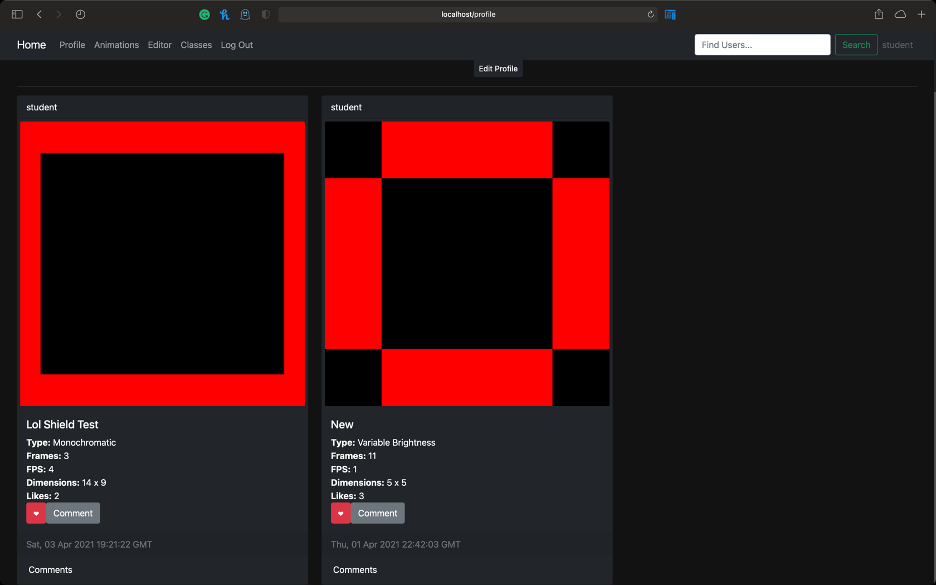</td>
<td></td>
<td></td>
<td></td>
<td></td>
</tr>
<tr class="odd">
<td>5</td>
<td>Un-liking a post.</td>
<td>Button press.</td>
<td>The button turns grey, the like count decreases and the database is updated.</td>
<td></td>
</tr>
<tr class="even">
<td></td>
<td></td>
<td></td>
<td></td>
<td></td>
</tr>
<tr class="odd">
<td>6</td>
<td>Commenting on a post.</td>
<td>Text input and button press.</td>
<td>The comment is added to the list of comments and the database is updated.</td>
<td></td>
</tr>
<tr class="even">
<td></td>
<td></td>
<td></td>
<td></td>
<td></td>
</tr>
<tr class="odd">
<td>7</td>
<td>Un-commenting on a post.</td>
<td>Button press.</td>
<td>The comment is removed from the list and the database is updated.</td>
<td></td>
</tr>
<tr class="even">
<td></td>
<td></td>
<td></td>
<td></td>
<td></td>
</tr>
<tr class="odd">
<td>8</td>
<td>Playing an animation.</td>
<td>Button press.</td>
<td>The play button disappears, the animation plays, then the play button reappears.</td>
<td></td>
</tr>
<tr class="even">
<td></td>
<td></td>
<td></td>
<td></td>
<td></td>
</tr>
<tr class="odd">
<td>9</td>
<td>Getting to the edit profile page.</td>
<td>Button press.</td>
<td>The edit profile page is shown, with the current bio auto filled.</td>
<td></td>
</tr>
<tr class="even">
<td></td>
<td></td>
<td></td>
<td></td>
<td></td>
</tr>
<tr class="odd">
<td>10</td>
<td>Changing the bio.</td>
<td>Text input and button press.</td>
<td>The database is updated, and the main profile page is shown.</td>
<td></td>
</tr>
<tr class="even">
<td></td>
<td></td>
<td></td>
<td></td>
<td></td>
</tr>
<tr class="odd">
<td>11</td>
<td>Changing the password.</td>
<td>Three text inputs and button press.</td>
<td><p>The old password is checked, the new password and new password confirmation are checked, then the database is updated.</p>
<p>The same tests were carried out here as for the signup page, to ensure that the password is valid.</p></td>
<td></td>
</tr>
<tr class="even">
<td></td>
<td></td>
<td></td>
<td></td>
<td></td>
</tr>
<tr class="odd">
<td></td>
<td></td>
<td></td>
<td></td>
<td></td>
</tr>
<tr class="even">
<td>12</td>
<td>Deleting your profile.</td>
<td>Button press.</td>
<td>The user is logged out, then their account is removed from the database.</td>
<td></td>
</tr>
</tbody>
</table>

## Classes

| **ID**                                                              | **Description**          | **Input**                                          | **Expected Output**                                                                                                                                                                             | **Actual Output** |
|---------------------------------------------------------------------|--------------------------|----------------------------------------------------|-------------------------------------------------------------------------------------------------------------------------------------------------------------------------------------------------|-------------------|
| 0                                                                   | Sending chat messages.   | Text input and button press.                       | The input field is emptied, and the message appears on the screen of every user who is viewing the chat. The database is also updated.                                                          |                   |
|  |                          |                                                    |                                                                                                                                                                                                 |                   |
| 1                                                                   | Deleting chat messages.  | Button press.                                      | The message disappears from every user’s screen. The database is also updated.                                                                                                                  |                   |
| 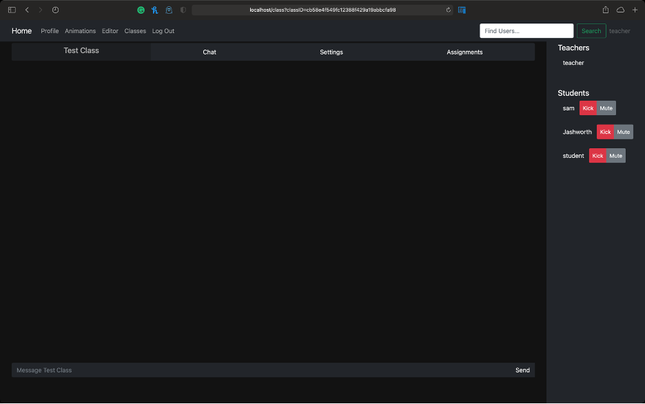 |                          |                                                    |                                                                                                                                                                                                 |                   |
| 2                                                                   | Muting users in chat.    | Button press.                                      | The mute button changes to an unmute button, and the user in question is no longer able to send messages. The database is also updated.                                                         |                   |
|  |                          |                                                    |                                                                                                                                                                                                 |                   |
| 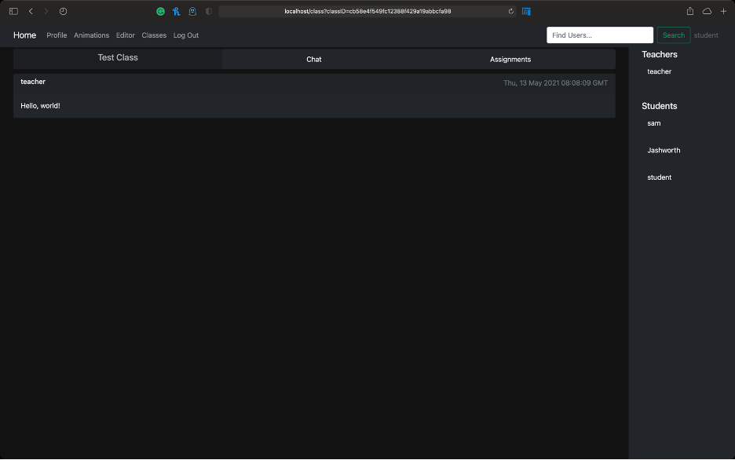 |                          |                                                    |                                                                                                                                                                                                 |                   |
| 3                                                                   | Kicking class members.   | Button press.                                      | The user is removed from the member list and is redirected back to the class page. The database is also updated.                                                                                |                   |
|  |                          |                                                    |                                                                                                                                                                                                 |                   |
| 4                                                                   | Creating assignments.    | Text inputs and a button press.                    | The input fields are emptied, the assignment is added to the list, and the database is updated.                                                                                                 |                   |
|  |                          |                                                    |                                                                                                                                                                                                 |                   |
|  |                          |                                                    |                                                                                                                                                                                                 |                   |
| 5                                                                   | Handing in assignments.  | One of the user’s animations from a dropdown list. | The assignment is changed to one which has been handed in, and the database is updated.                                                                                                         |                   |
|  |                          |                                                    |                                                                                                                                                                                                 |                   |
| 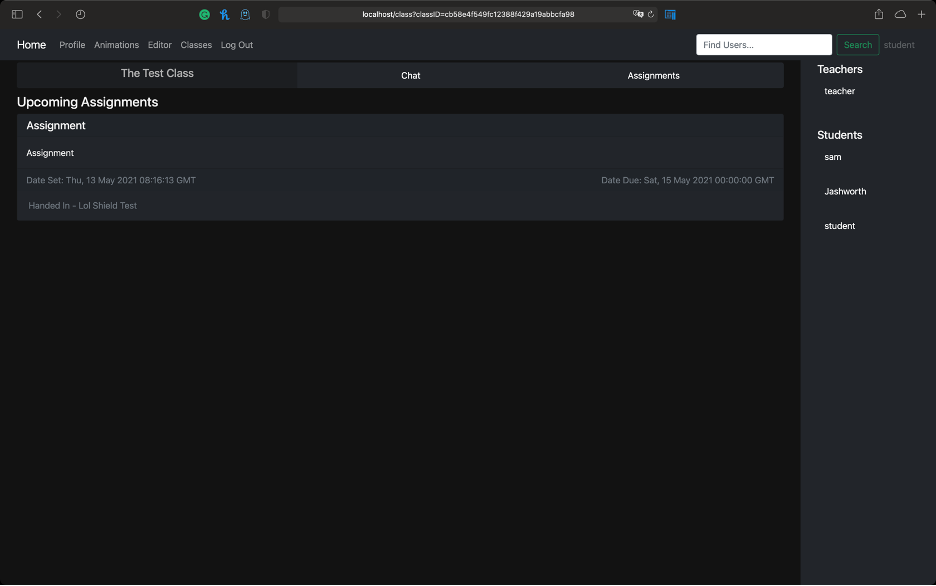 |                          |                                                    |                                                                                                                                                                                                 |                   |
| 6                                                                   | Deleting assignments.    | Button press.                                      | The assignment is removed from the list and the database is updated.                                                                                                                            |                   |
| 7                                                                   | Changing the class name. | Text input then button press.                      | The page refreshes, and the database is updated.                                                                                                                                                |                   |
|  |                          |                                                    |                                                                                                                                                                                                 |                   |
|  |                          |                                                    |                                                                                                                                                                                                 |                   |
| 8                                                                   | Toggling the chat.       | Checkbox.                                          | The page refreshes, and the database is updated.                                                                                                                                                |                   |
|  |                          |                                                    |                                                                                                                                                                                                 |                   |
|  |                          |                                                    |                                                                                                                                                                                                 |                   |
| 9                                                                   | Deleting the class.      | Button press.                                      | The page refreshes, and the database is updated.                                                                                                                                                |                   |
| 10                                                                  | Joining a class.         | Text input then button press.                      | The class code is checked to see if it is valid. If it is, the user is redirected to that class, otherwise, they are informed that the code is invalid. The database is then updated if needed. |                   |
|  |                          |                                                    |                                                                                                                                                                                                 |                   |
|  |                          |                                                    |                                                                                                                                                                                                 |                   |
| 11                                                                  | Creating a class.        | Text input then button press.                      | The user is redirected to the new class after the database has been updated.                                                                                                                    |                   |
|  |                          |                                                    |                                                                                                                                                                                                 |                   |
|  |                          |                                                    |                                                                                                                                                                                                 |                   |

## Creating Animations

| **ID**                                                              | **Description**                                  | **Input**                                      | **Expected Output**                                                                                                   | **Actual Output** |
|---------------------------------------------------------------------|--------------------------------------------------|------------------------------------------------|-----------------------------------------------------------------------------------------------------------------------|-------------------|
| 0                                                                   | Loading a pre-made animation.                    | Dropdown menu.                                 | The animation is loaded into the editor.                                                                              |                   |
|  |                                                  |                                                |                                                                                                                       |                   |
|  |                                                  |                                                |                                                                                                                       |                   |
| 1                                                                   | Creating a new animation, with pre-set settings. | Dropdown menu and text input.                  | A new blank animation is loaded, with the settings specified.                                                         |                   |
| 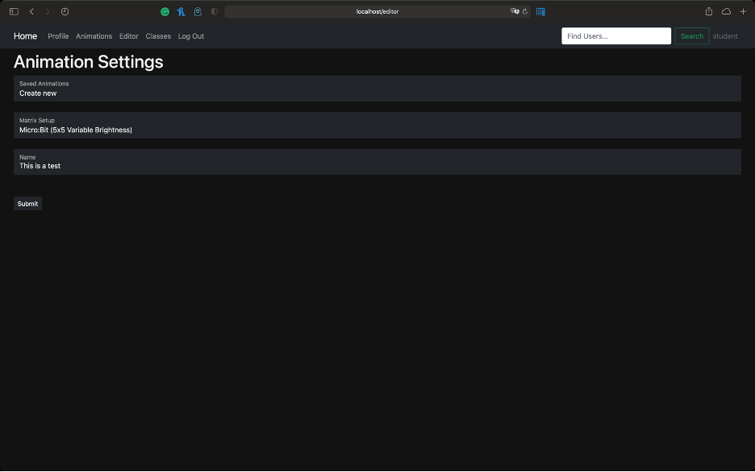 |                                                  |                                                |                                                                                                                       |                   |
|  |                                                  |                                                |                                                                                                                       |                   |
| 2                                                                   | Creating a completely custom animation.          | Text input, dropdowns menus and radio buttons. | A new animation is loaded using the custom settings.                                                                  |                   |
|  |                                                  |                                                |                                                                                                                       |                   |
|  |                                                  |                                                |                                                                                                                       |                   |
| 3                                                                   | Switching LEDs on and off.                       | Button press.                                  | The button changes to the currently selected colour if it was off, or changes to the off colour if it was already on. |                   |
|  |                                                  |                                                |                                                                                                                       |                   |
|  |                                                  |                                                |                                                                                                                       |                   |
| 4                                                                   | Drawing pre-set graphics.                        | Button press.                                  | The pre-set graphic is drawn onto the editor.                                                                         |                   |
|  |                                                  |                                                |                                                                                                                       |                   |
|  |                                                  |                                                |                                                                                                                       |                   |
| 5                                                                   | Clearing the screen.                             | Button press.                                  | The screen is cleared.                                                                                                |                   |
|  |                                                  |                                                |                                                                                                                       |                   |
| 6                                                                   | Filling the screen.                              | Button press.                                  | The screen is filled with the current colour.                                                                         |                   |
|  |                                                  |                                                |                                                                                                                       |                   |
| 7                                                                   | Inverting the screen.                            | Button press.                                  | The screen is inverted.                                                                                               |                   |
|  |                                                  |                                                |                                                                                                                       |                   |
| 8                                                                   | Drawing straight lines.                          | Shift key and button presses.                  | A straight line is drawn between the two points that are clicked.                                                     |                   |
| 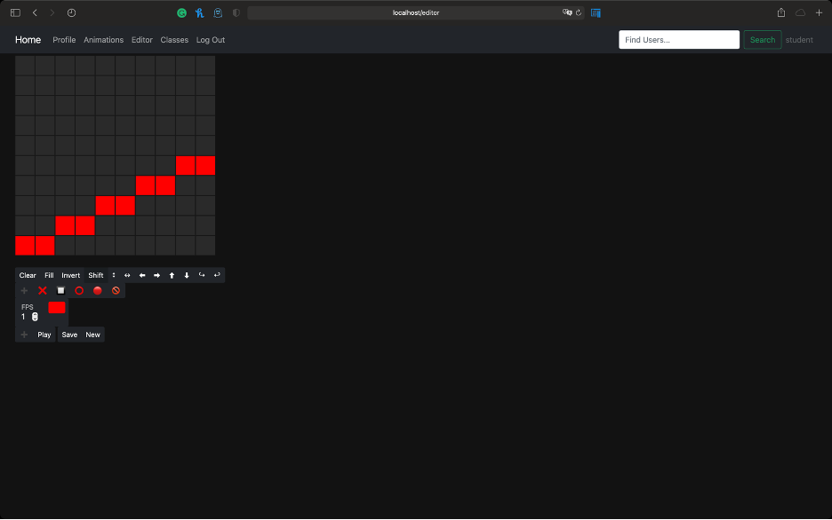 |                                                  |                                                |                                                                                                                       |                   |
| 9                                                                   | Flipping the image vertically.                   | Button press.                                  | The image is flipped vertically.                                                                                      |                   |
|  |                                                  |                                                |                                                                                                                       |                   |
|  |                                                  |                                                |                                                                                                                       |                   |
| 10                                                                  | Flipping the image horizontally.                 | Button press.                                  | The image is flipped horizontally.                                                                                    |                   |
|  |                                                  |                                                |                                                                                                                       |                   |
|  |                                                  |                                                |                                                                                                                       |                   |
| 11                                                                  | Shifting the image to the left.                  | Button press.                                  | The image shifts one square to the left.                                                                              |                   |
|  |                                                  |                                                |                                                                                                                       |                   |
| 12                                                                  | Shifting the image to the right.                 | Button press.                                  | The image shifts one square to the right.                                                                             |                   |
| 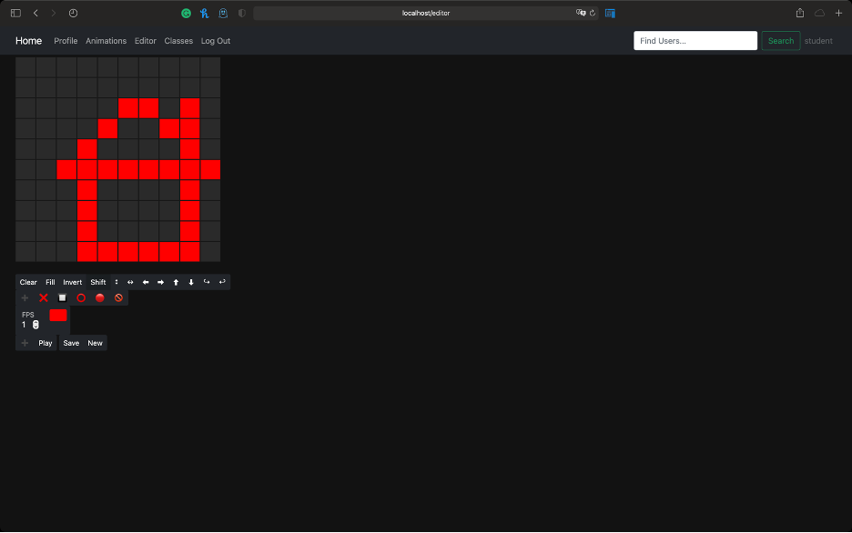 |                                                  |                                                |                                                                                                                       |                   |
| 13                                                                  | Shifting the image up.                           | Button press.                                  | The image shifts one square up.                                                                                       |                   |
|  |                                                  |                                                |                                                                                                                       |                   |
| 14                                                                  | Shifting the image down.                         | Button press.                                  | The image shifts one square down.                                                                                     |                   |
| 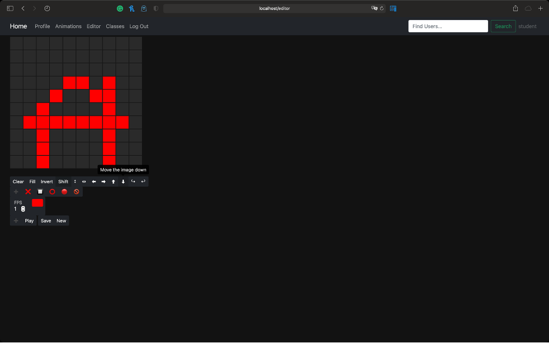 |                                                  |                                                |                                                                                                                       |                   |
| 15                                                                  | Rotating the image clockwise.                    | Button press.                                  | The image is rotated 90 degrees clockwise.                                                                            |                   |
| 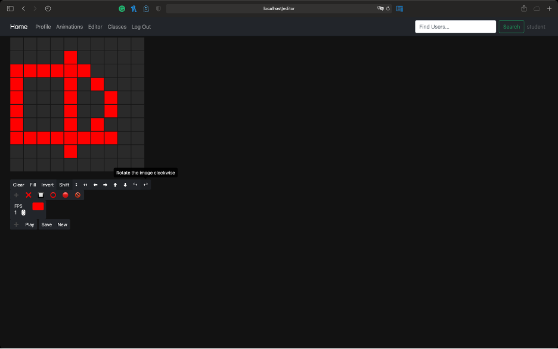 |                                                  |                                                |                                                                                                                       |                   |
| 16                                                                  | Rotating the image anticlockwise.                | Button press.                                  | The image is rotated 90 degrees anticlockwise.                                                                        |                   |
|  |                                                  |                                                |                                                                                                                       |                   |
| 17                                                                  | Adding a frame.                                  | Button press.                                  | The screen is cleared, and the frame is added to the timeline.                                                        |                   |
|  |                                                  |                                                |                                                                                                                       |                   |
| 18                                                                  | Copying a frame from the timeline.               | Button press.                                  | The frame is copied from the timeline to the screen.                                                                  |                   |
|  |                                                  |                                                |                                                                                                                       |                   |
| 19                                                                  | Deleting a frame from the timeline.              | Button press.                                  | The frame is deleted from the timeline.                                                                               |                   |
| 20                                                                  | Playing back the animation.                      | Button press.                                  | The preview appears and plays the animation at the specified fps.                                                     |                   |
| 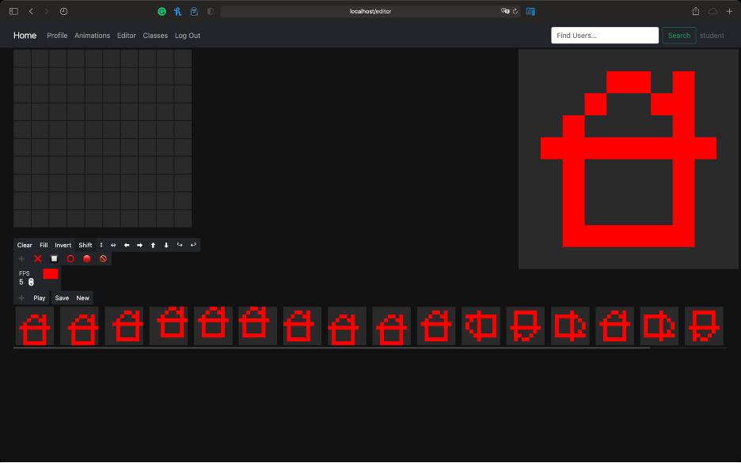 |                                                  |                                                |                                                                                                                       |                   |
| 21                                                                  | Saving the animation.                            | Button press.                                  | The database is updated and a confirmation message is shown.                                                          |                   |
|  |                                                  |                                                |                                                                                                                       |                   |
| 22                                                                  | Reordering the frames.                           | Drag and drop.                                 | The frames are reordered.                                                                                             |                   |

## Generating Code

| **ID**                                                              | **Description**               | **Input**    | **Expected Output**       | **Actual Output** |
|---------------------------------------------------------------------|-------------------------------|--------------|---------------------------|-------------------|
| 0                                                                   | BBC Micro:Bit MicroPython     | Button press | Correct and working code. |                   |
|  |                               |              |                           |                   |
| 1                                                                   | BBC Micro:Bit TypeScript      | Button press | Correct and working code. |                   |
|  |                               |              |                           |                   |
| 2                                                                   | Arduino C++                   | Button press | Correct and working code. |                   |
|  |                               |              |                           |                   |
| 3                                                                   | Raspberry Pi Pico C++         | Button press | Correct and working code. |                   |
|  |                               |              |                           |                   |
| 4                                                                   | Raspberry Pi Pico MicroPython | Button press | Correct and working code. |                   |
|  |                               |              |                           |                   |

## Playing Animations on Microcontrollers

| **ID**                                                                   | **Description**                    | **Input** | **Expected Output**                                    | **Actual Output** |
|--------------------------------------------------------------------------|------------------------------------|-----------|--------------------------------------------------------|-------------------|
| 0                                                                        | Playback on the BBC Micro:Bit.     | N/A       | The animation is played on the appropriate LED matrix. |                   |
| 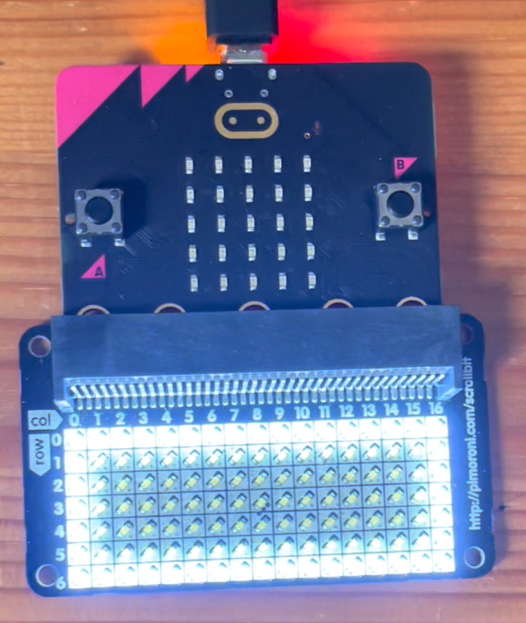 |                                    |           |                                                        |                   |
| 1                                                                        | Playback on the Arduino.           | N/A       | The animation is played on the appropriate LED matrix. |                   |
| 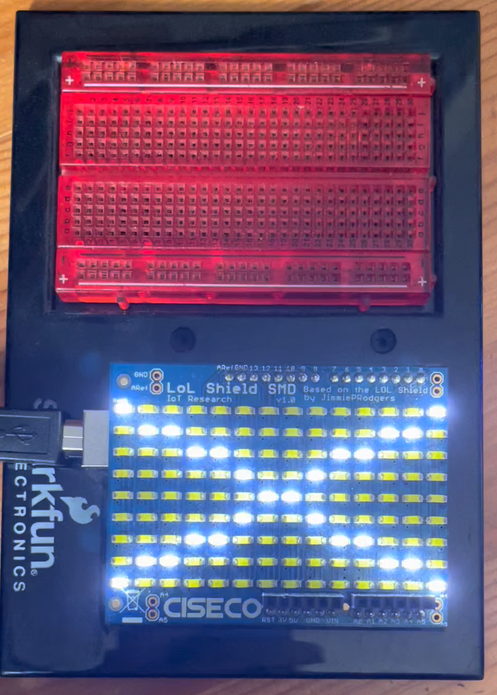 |                                    |           |                                                        |                   |
| 2                                                                        | Playback on the Raspberry Pi Pico. | N/A       | The animation is played on the appropriate LED matrix. |                   |
|     |                                    |           |                                                        |                   |

# Technical Solution

## File Structure
```
.
├── .eslintrc
├── .gitignore
├── .htaccess
├── .vscode
│ └── settings.json
├── CSS
│ └── main.css
├── Classes
│ ├── JavaScript
│ │ ├── AnimationEditor.js
│ │ └── Matrix.js
│ ├── PHP
│ │ ├── animation.php
│ │ ├── assignment.php
│ │ ├── assignmentWork.php
│ │ ├── comment.php
│ │ ├── frame.php
│ │ ├── group.php
│ │ ├── message.php
│ │ ├── post.php
│ │ └── user.php
│ └── TypeScript
│ ├── AnimationEditor.ts
│ └── Matrix.ts
├── Database
│ └── database.php
├── Include
│ ├── footer.inc
│ ├── header.inc
│ ├── loginForm.inc
│ ├── redirect.inc
│ └── signupForm.inc
├── Pages
│ ├── 404.php
│ ├── animations.php
│ ├── class.php
│ ├── editor.php
│ ├── generateCode.php
│ ├── home.php
│ ├── login.php
│ ├── logout.php
│ ├── profile.php
│ └── signup.php
├── Utils
│ ├── Forms
│ │ ├── createAssignment.php
│ │ ├── createClass.php
│ │ ├── deleteAnimation.php
│ │ ├── deleteAssignment.php
│ │ ├── deleteChatMessage.php
│ │ ├── deleteClass.php
│ │ ├── deleteComment.php
│ │ ├── deleteUser.php
│ │ ├── followUser.php
│ │ ├── generateCode.php
│ │ ├── getClassMembers.php
│ │ ├── handInAssignment.php
│ │ ├── joinClass.php
│ │ ├── kickUserFromClass.php
│ │ ├── likePost.php
│ │ ├── makeAdmin.php
│ │ ├── muteUserInClass.php
│ │ ├── postComment.php
│ │ ├── resetPassword.php
│ │ ├── saveAnimation.php
│ │ ├── saveClass.php
│ │ ├── sendChatMessage.php
│ │ ├── shareAnimation.php
│ │ ├── unFollowUser.php
│ │ ├── unLikePost.php
│ │ ├── unMuteUserInClass.php
│ │ ├── unShareAnimation.php
│ │ ├── updateClassChatInput.php
│ │ └── updateMessages.php
│ └── Functions
│ ├── arrayMappers.php
│ └── arraySorters.php
├── index.php
└── tsconfig.json
```

The technical solution has been omitted from this document.

# Appraisal

## Objectives

### The solution must allow users to choose which microcontroller (BBC Micro:Bit or Arduino) and which LED matrix they wish to use. [Core]

This objective has been met. When creating a new animation, the user is asked for the properties of their LED matrix. They are given a dropdown of pre-set matrices to choose from, but can also set a custom width, height and mode (monochromatic, variable brightness or RGB). The user is asked which LED matrix and which microcontroller they wish to use when they generate the code for an animation.

### The solution should allow users to choose which language they want the code output to be written in where possible. [Core]

This objective has been met. When generating the code output for an animation, as well as being asked which LED matrix and which microcontroller the user wishes to use, they are also asked which language they wish to use. The languages listed are only the languages which can be used on their selected microcontroller.

### The solution must output the appropriate, functioning code for the selected microcontroller and LED matrix, with documentation where possible. [Core]

This objective has been met. The user can output functioning code for the Arduino, the BBC Micro:Bit and the Raspberry Pi Pico. The code is available in C++ for the Arduino, MicroPython and TypeScript for the BBC Micro:Bit, and C++ and MicroPython for the Raspberry Pi Pico. If the user is not using a supported LED matrix, the code output includes empty functions to switch an LED on, and to clear the screen, and informs the user that they must fill in these functions themselves.

### The solution should provide users with large, clearly labelled circuit diagrams where needed. [Extension]

This objective has not been met. For most of the supported LED matrices, a circuit diagram is not required, as the LED matrix connects to the microcontroller by plugging into every pin. In the cases where the matrix does not do this, such as the NeoPixel 8x8 RGB LED matrix, there code includes a comment telling the user which data pin should be used.

### The solution could allow users to download the output code and/or binary files. [Extension]

This objective has been partially met. When the user generates a code output, a copy to clipboard button appears, which allows the user to copy the code. This can then be pasted into the appropriate file and uploaded to their microcontroller. Binary/hex files are not generated by the solution.

### The solution should provide an animation timeline to allow easy editing of animations. [Core]

This objective has been met. The animation editor page includes a timeline at the bottom. The frames on this time line can be copied to the editor, can be deleted, and can be reordered by dragging and dropping.

### The solution could provide a library of pre-made animations for users to use as examples. [Extension]

This objective has not been met. The solution does not provide example animations however, a user could search for the test student user that was created, which has several animations on its profile. Although no example animations have been provided, there are a few graphics which can be added to an animation which will be drawn to fit the size of the requested LED matrix.

### The solution should provide an emulator to show the animations without needing a microcontroller to hand. [Core]

This objective has been met. Every animation that a user creates can be viewed on their animations page. Each animation on this page has a play button and an FPS input which allows the user to play the animation without needing to download any code.

### The solution must allow users to follow other specific users. [Core]

This objective has been met. A user can search for another user by typing their username (or a part of their username) into the search field. When they do this, they are able to click on each result to access that user’s profile page. From this page, they are able to follow the selected user.

### The solution must allow users to view content shared by the users they follow. [Core]

This objective has been met. When a user has followed other users, those users shared animations will appear in the logged in user’s feed on their homepage. The feed is sorted with the newest posts at the top, and includes the posts from all followed users, and the logged in user.

### The solution must allow users to post comments on each other’s shared work. [Core]

This objective has been met. When viewing a post, there is a comments dropdown to read any comments that have been made on the post. There is also a comment button which shows a comment input field when clicked. When a comment is submitted it appears in the dropdown section.

### The solution should allow users to like each other’s shared work. [Core]

This objective has been met. Alongside the comment button, each post has a like button. When clicked, this button turns red, and the like count on the post increases. When clicked again, this button turns back to grey, and the like counter decreases.

### The solution should allow users to view all shared content from a specific user in a profile page. [Core]

This objective has been met. Each user’s profile page can be viewed by any other user. Any animations which a user shares can be viewed as posts on their profile page. The posts are sorted with the newest posts at the top. Posts on the profile page are identical to posts in a user’s feed, meaning you can like and comment on the post from the profile page.

### The solution could allow users to pin specific posts to the top of their profile page. [Extension]

This objective has not been met. It was decided that this objective was an unnecessary feature for the website.

### The solution must allow teachers to set assignments for students to complete. [Core]

This objective has been met. Teachers can create assignments with a description, and a deadline. Students can then select an animation which they have created and can hand in each assignment. Once work has been handed in, the teacher can view each animation, and generate code for it.

### The solution must provide a chat room for each class to communicate via. [Core]

This objective has been met. The chat room allows user to send messages, and updates live for every user that is viewing that page. Each message can be deleted by the user who sent it.

### The solution could provide users with the ability to upload attachments to the class chat. [Extension]

This objective has not been met. It was decided that this was not a necessary feature.

### The solution must allow teachers to moderate the chat to keep it safe and appropriate for students. [Extension]

This objective has been met. Teachers can delete any message, even if it was sent by another user. They can also mute students, to prevent them from sending any more messages. When a user is muted, they can also be unmuted.

### The solution must allow teachers to add and remove members of the class. [Core]

This objective has been met. The member list on the right-hand side of the screen provided button to mute and kick students from the class. To add new users, the teacher can navigate to the class settings page, and can copy the class ID. This ID can be sent to students or other teachers, who can then paste it into the join class field on the classes page, which will then add them to that class.

### The solution should provide a page to view all recent posts from a class. [Extension]

This objective has been partially met. There is no page which groups posts from all class members, but the member list has a link to each user’s profile page, which allows you to view that user’s posts.

### The solution must be easy to use and navigate for both experienced users (teachers) and inexperienced users (students). [Core]

This objective has been met. The website is laid out such it is obvious for any user to navigate. New users have buttons on their homepage to join classes and create animations, while users who have already done this, have links to some of their newest classes or animations on their homepages.

### The solution should allow common and intuitive interface methods such as drag and drop where appropriate. [Core]

This objective has been met. The interface is very intuitive, especially for creating animations. Switching an LED on in the editor is as simple as clicking the button which represents that LED. Every button on the editor also has a tooltip to remind the user of what it does. Reordering frames is as simple as dragging them to the desired position on the timeline.

### The solution should only allow access to the correct parts of the site for the correct users. [Core]

This objective has been met. Teachers and students are unable to access the admin page. Students are unable to access the class settings page. Apart from these, students and teachers can access every other page. Admins can access other page by typing the URL directly but will rarely need to do this.

### The solution must ensure that the database complies with The Data Protection Act by not allowing any unauthorised access. [Core]

This objective has been met. Users are not able to access any data from the database which is not relevant to them, or which has not been shared by the user to whom it is relevant.

### The solution must be able to handle multiple users accessing the database simultaneously. [Core]

This objective has been met. There is absolutely no problem with having multiple users connected to the site at one time.

## User Feedback

### How would you rate your overall experience of the website?

#### Joseph Ashworth

> 8/10

#### Taylor-Mae Dodd

> 9/10

#### Samuel Williams

> 8/10

### Did you find that the site was intuitive to use? Please provide an example of what you found to be most intuitive and what you found to be least intuitive.

#### Joseph Ashworth

> It is mostly pretty intuitive. Most intuitive would just be that when you click on the grid, that cell lights up. Least intuitive I guess would be that you use the same image for putting a plus on the grid and adding a new frame.

#### Taylor-Mae Dodd

> Creating the animation overall was intuitive and least intuitive was browsing users.

#### Samuel Williams

> Yes, it was quite intuitive. The blank screen when not logged in wasn't too helpful, and the editor seems to be the part with the best UI.

### What features would like to see added to this website?

#### Joseph Ashworth

> I guess have a help button which would let the user know what each part of the page does and if there is anything that isn’t immediately obvious. Also, liking comments maybe.

#### Taylor-Mae Dodd

> It may be useful to have help pages available to the user to explain what they can do and what each section is. Overall, this makes the program more user friendly.

#### Samuel Williams

> Copy other people's animations to edit for yourself.

### Did you find anything in this website which did not behave as you would expect it to?

#### Joseph Ashworth

> When I clicked save, then went to a different site temporarily and came back, not all of it had saved.

#### Taylor-Mae Dodd

> The save bar was a bit inconvenient. Otherwise, all ran as expected.

#### Samuel Williams

> The animation saved appearing beneath the animation so it cannot close. Any other bugs found were fixed before testing finished, but animations with long titles didn't save.

## Analysis of Feedback

The system was tested by three students. Overall satisfaction from the users who tested the program was very high, with an average rating of 8.3/10. This suggests that the user experience was more than satisfactory, and all users agreed that the site was quite intuitive to use.

In terms of that intuitive experience, suitable for both younger users as well as older, all testers agreed that the animation editor was the most intuitive part of the site. It was noted particularly that being able to click on an LED to toggle it on and off was especially intuitive.

On the flip side, each user had a different opinion on which part of the site was least intuitive. One user noted that more distinct symbols should be used for some buttons, a second user stated that searching for other user profiles was least intuitive, while the final user argued that the very plain home page for users who are not logged in was not helpful, despite it clearly stating that the user must log in to access the site. The fact that no users agreed on a distinctively unintuitive aspect of the site, would suggest that a larger group of users would find the vast majority of the site to be very easy to use.

When it came to suggesting more features for the site, two users agreed that a help page which would explain the features of each other page would be a nice addition. Users also suggested that the ability to like/upvote comments, and the ability to copy and edit other users’ animations. I believe that a help page would be a good addition, as would that ability to copy and modify your own version of someone else’s animation. The ability to like comments, however, is not a feature that I feel would provide any true benefits.

Finally, when asked if they encountered any unexpected behaviours when using the site, most users commented that the “Animation Saved” notification bar could not be closed if they pressed save, then activated playback for that animation. This bug has since been fixed. There was also an issue encountered where the name of animation was too long to be saved to the database, this has also been fixed. It was also noted that once an animation became too long, switching between pages no longer saved the full animation in the session.

## Improvements

Based on user feedback, the following improvements have been identified.

| **Improvement**    | **Description**                                                                                                                                                                                                           |
|--------------------|---------------------------------------------------------------------------------------------------------------------------------------------------------------------------------------------------------------------------|
| A help page.       | This page would describe every feature on the site, and would explain exactly what they do, and how to use them. Such a page would act as a wiki which users could easily navigate to find what they need without hassle. |
| Animation forking. | This feature would be similar to forking a repository on GitHub, and would allow users to duplicate someone else’s animation, and then make their own edits to that animation.                                            |
| Circuit diagrams.  | These would be helpful for users who have to connect LED matrices to microcontrollers without user shield boards. It is not an essential feature but would all the same be beneficial to younger users.                   |
